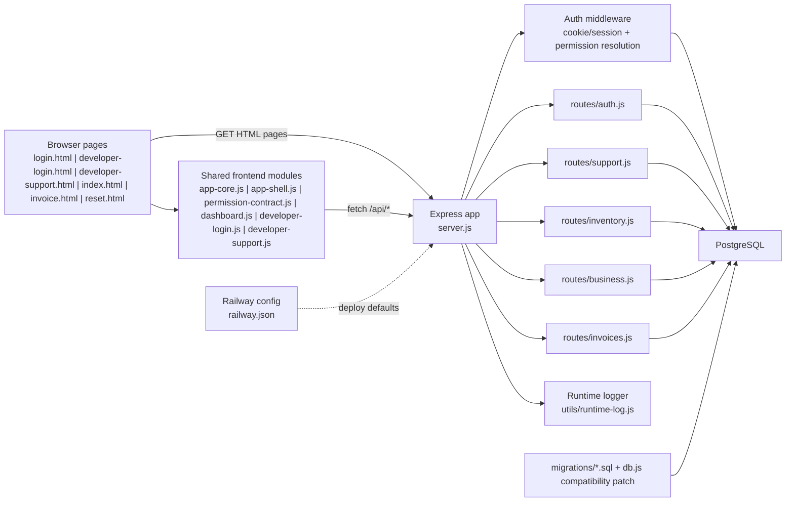
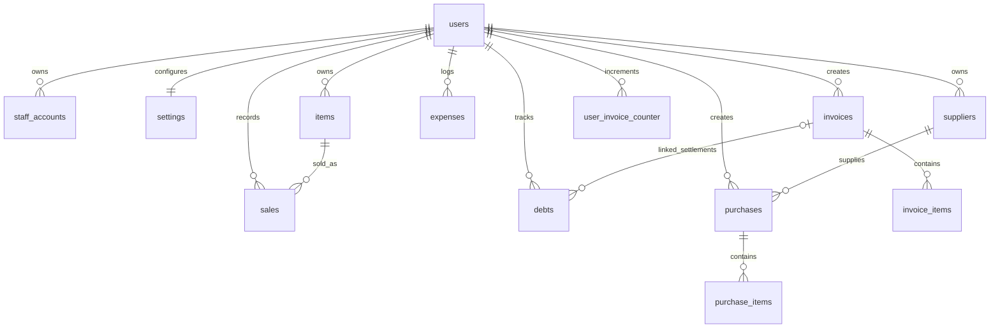

# India Inventory Management Documentation

Last verified against this repository: `2026-04-13`

This is the single merged documentation file for the project. It replaces the earlier split project doc and database schema doc.

## Table Of Contents

- [Purpose](#1-purpose)
- [Project Snapshot](#2-project-snapshot)
- [Technology Stack](#3-technology-stack)
- [Repository Map](#4-repository-map)
- [High-Level Architecture](#5-high-level-architecture)
- [Frontend Structure](#6-frontend-structure)
- [Backend Structure](#7-backend-structure)
- [Auth, Session, and Permission Model](#8-auth-session-and-permission-model)
- [Security and Runtime Guardrails](#9-security-and-runtime-guardrails)
- [Main Business Workflows](#10-main-business-workflows)
- [API Route Map](#11-api-route-map)
- [Database Schema](#12-database-schema)
- [Environment Variables](#13-environment-variables)
- [Maintenance Guide](#14-maintenance-guide)
- [Detailed Architecture Diagram](#15-detailed-architecture-diagram)
- [Final Summary](#16-final-summary)

## 1. Purpose

This document is meant to be the current source of truth for:

- what the project does
- how the frontend, backend, and database are organized
- which APIs exist
- which database tables exist and how they relate
- which shared functions, middleware helpers, and runtime primitives exist
- which files to edit for common future changes

Important current-state notes:

- Authentication is cookie-based. The frontend uses `credentials: "include"` and bootstraps sessions through `/api/auth/me`.
- Developer support authentication is also cookie-based through `/api/developer-auth/*`; the browser no longer stores a readable developer JWT in session storage.
- `localStorage` is still used for UI state and invoice draft storage, but not as the primary auth token store.
- HTML pages are served through [`server.js`](../server.js), which injects a CSP nonce into inline scripts and styles.
- Database schema truth comes from the SQL files in [`migrations/`](../migrations) plus runtime compatibility patches in [`db.js`](../db.js).
- The app now includes an owner/staff support chat plus dedicated developer support login and inbox pages backed by [`../routes/support.js`](../routes/support.js).
- Runtime health and readiness now expose structured JSON payloads through `/health`, `/api/health`, `/healthz`, `/ready`, `/readyz`, `/live`, and `/livez`.
- Structured runtime logs now redact password, token, authorization, cookie, and access-key fields before emitting JSON.
- Deployment healthcheck and start-command defaults are now pinned in [`../railway.json`](../railway.json), and lifecycle/request logging is centralized through [`../utils/runtime-log.js`](../utils/runtime-log.js).

## 2. Project Snapshot

This is a Node.js + Express + PostgreSQL business app for a shop owner.

Main business modules:

- owner registration and login
- staff login with page-level permissions
- owner/staff support chat with a developer inbox
- developer support account registration and login
- stock entry and stock defaults
- purchase entry with supplier ledger and supplier repayment tracking
- sales invoice creation with PDF generation
- invoice history, due settlement, and payment collection
- customer due ledger
- sales, stock, and GST reports
- expense tracking and net profit visibility

The system is owner-centric:

- the `users` table stores the real business owner
- `staff_accounts` work under that owner
- almost all business data is stored against `user_id`
- staff actions operate inside the owner's data scope

## 3. Technology Stack

### Backend

- Node.js 18+
- Express
- PostgreSQL via `pg`
- JWT via `jsonwebtoken`
- `bcrypt` for password hashing
- `helmet`, `cors`, `cookie-parser`, `compression`, `express-rate-limit`
- `pdfkit` for PDF generation
- `exceljs` for Excel export

### Deployment and runtime

- Railway config-as-code via [`../railway.json`](../railway.json)
- structured JSON lifecycle logging via [`../utils/runtime-log.js`](../utils/runtime-log.js)
- health/readiness/liveness endpoints emitted by [`../server.js`](../server.js)
- current Railway defaults in repo:
  - start command: `node --max-old-space-size=256 server.js`
  - healthcheck path: `/health`
  - healthcheck timeout: `120`
  - restart policy: `ON_FAILURE`
  - max restart retries: `10`

### Frontend

- static HTML pages in [`public/`](../public)
- vanilla JavaScript
- shared page configuration in [`public/js/app-core.js`](../public/js/app-core.js)
- shared sidebar shell in [`public/js/app-shell.js`](../public/js/app-shell.js)
- permission contract in [`public/js/permission-contract.js`](../public/js/permission-contract.js)
- charts via vendored [`public/js/chart.min.js`](../public/js/chart.min.js)

### Data and schema

- SQL schema snapshots in [`migrations/full_updated_schema.sql`](../migrations/full_updated_schema.sql)
- startup compatibility patching in [`db.js`](../db.js)
- future incremental SQL migrations belong in [`migrations/`](../migrations) when schema changes need to be tracked separately

## 4. Repository Map

| Path                                 | Purpose                                                                                                  |
| ------------------------------------ | -------------------------------------------------------------------------------------------------------- |
| [`../server.js`](../server.js)       | app bootstrap, middleware, request logging, health/readiness routes, and HTML serving                    |
| [`../db.js`](../db.js)               | PostgreSQL pool setup, readiness state, and schema compatibility patches                                 |
| [`../railway.json`](../railway.json) | Railway deployment config: start command, healthcheck path, timeout, restart policy                      |
| [`../middleware/`](../middleware)    | auth and access control middleware                                                                       |
| [`../routes/`](../routes)            | route files grouped by business domain                                                                   |
| [`../public/`](../public)            | HTML pages, frontend JS, images                                                                          |
| [`../utils/`](../utils)              | shared backend helpers such as advisory locking and structured runtime logging                           |
| [`../migrations/`](../migrations)    | SQL schema and migration history                                                                         |
| [`../docs/`](.)                      | project documentation, including this merged file, the detailed flow chart, and the public marketing kit |

### Key backend files

| File                                                 | Role                                                                                                       |
| ---------------------------------------------------- | ---------------------------------------------------------------------------------------------------------- |
| [`../server.js`](../server.js)                       | Express entrypoint, request logging, CSP nonce injection, CORS policy, health/debug routes, static serving |
| [`../db.js`](../db.js)                               | DB connection pool, readiness state, SSL selection, startup schema patching                                |
| [`../middleware/auth.js`](../middleware/auth.js)     | JWT verification, role resolution, permission checks                                                       |
| [`../routes/auth.js`](../routes/auth.js)             | register/login/logout, forgot/reset password, staff management, `/me`                                      |
| [`../routes/support.js`](../routes/support.js)       | developer auth, owner/staff support chat, developer inbox, conversation status updates                     |
| [`../routes/inventory.js`](../routes/inventory.js)   | stock, stock reports, sales reports, GST reports, dashboard overview, customer dues                        |
| [`../routes/business.js`](../routes/business.js)     | suppliers, purchases, purchase repayment, expenses                                                         |
| [`../routes/invoices.js`](../routes/invoices.js)     | invoice numbering, invoice save, history, payment settlement, PDF, shop info                               |
| [`../utils/concurrency.js`](../utils/concurrency.js) | normalization helpers and owner-scoped advisory locks                                                      |
| [`../utils/runtime-log.js`](../utils/runtime-log.js) | structured JSON log serializer used by server and DB lifecycle logging                                     |
| [`../railway.json`](../railway.json)                 | Railway config-as-code for runtime start and healthcheck defaults                                          |

### Key frontend files

| File                                                                         | Role                                                                                 |
| ---------------------------------------------------------------------------- | ------------------------------------------------------------------------------------ |
| [`../public/login.html`](../public/login.html)                               | landing page, owner login/register, staff login, forgot password                     |
| [`../public/developer-login.html`](../public/developer-login.html)           | developer account login/register page for the support inbox                          |
| [`../public/developer-support.html`](../public/developer-support.html)       | developer support queue and threaded reply workspace                                 |
| [`../public/index.html`](../public/index.html)                               | main dashboard shell with stock, purchase, reports, due, expense, and staff sections |
| [`../public/invoice.html`](../public/invoice.html)                           | sale and invoice workspace, invoice history, PDF actions, shop profile               |
| [`../public/reset.html`](../public/reset.html)                               | reset password page                                                                  |
| [`../public/js/developer-login.js`](../public/js/developer-login.js)         | developer login/register controller                                                  |
| [`../public/js/developer-support.js`](../public/js/developer-support.js)     | developer inbox queue, thread, reply, and status update controller                   |
| [`../public/js/dashboard.js`](../public/js/dashboard.js)                     | main dashboard logic and report UI orchestration                                     |
| [`../public/js/app-core.js`](../public/js/app-core.js)                       | shared constants, permission descriptions, app bootstrap helpers                     |
| [`../public/js/app-shell.js`](../public/js/app-shell.js)                     | reusable sidebar shell and page navigation                                           |
| [`../public/js/permission-contract.js`](../public/js/permission-contract.js) | single permission vocabulary shared by backend and frontend                          |

## 5. High-Level Architecture



### Request flow in practice

1. Browser requests `login.html`, `developer-login.html`, `developer-support.html`, `index.html`, `invoice.html`, or `reset.html`.
2. [`server.js`](../server.js) serves those pages through `sendHtmlTemplate(...)`, replacing `__CSP_NONCE__` placeholders.
3. Frontend scripts call `/api/...` endpoints with `credentials: "include"`.
4. [`middleware/auth.js`](../middleware/auth.js) resolves the current owner/staff session or developer support session as needed.
5. The matching route file runs business logic and queries PostgreSQL.
6. Health endpoints can report readiness or liveness without crossing the authenticated route stack.
7. PDF and Excel exports are generated directly inside route handlers.

## 6. Frontend Structure

### Page responsibilities

| Page                                                                   | What it does                                                                                    |
| ---------------------------------------------------------------------- | ----------------------------------------------------------------------------------------------- |
| [`../public/login.html`](../public/login.html)                         | auth entrypoint for owner and staff, forgot password entry, existing-session redirect           |
| [`../public/developer-login.html`](../public/developer-login.html)     | developer account login/register screen for the support inbox                                   |
| [`../public/developer-support.html`](../public/developer-support.html) | developer queue and threaded support reply workspace                                            |
| [`../public/index.html`](../public/index.html)                         | multi-section dashboard for stock, purchases, reports, dues, expenses, and staff owner controls |
| [`../public/invoice.html`](../public/invoice.html)                     | invoice builder, draft restore, payment summary, invoice lookup, invoice PDF actions            |
| [`../public/reset.html`](../public/reset.html)                         | password reset submission using email + token from URL hash                                     |

### Shared frontend module roles

- [`../public/js/app-core.js`](../public/js/app-core.js)
  - defines the page permission descriptions and sidebar item metadata
  - resolves `apiBase`
  - exposes shared app-level helpers

- [`../public/js/app-shell.js`](../public/js/app-shell.js)
  - renders the sidebar
  - applies page-aware navigation
  - injects shell styles in a CSP-compatible way

- [`../public/js/permission-contract.js`](../public/js/permission-contract.js)
  - defines the canonical permission keys:
    - `add_stock`
    - `purchase_entry`
    - `sale_invoice`
    - `stock_report`
    - `sales_report`
    - `gst_report`
    - `customer_due`
    - `expense_tracking`

- [`../public/js/dashboard.js`](../public/js/dashboard.js)
  - drives most dashboard features
  - loads and submits stock, purchase, report, due, expense, and staff data
  - handles popups, section switching, and report export actions

- [`../public/js/developer-login.js`](../public/js/developer-login.js)
  - handles developer sign-in and optional developer account creation
  - normalizes the private developer setup key before submission
  - verifies an existing developer session through `/api/developer-auth/me`

- [`../public/js/developer-support.js`](../public/js/developer-support.js)
  - loads the developer inbox queue and threaded conversation state
  - sends replies, changes conversation status, and refreshes queue counters
  - escapes requester and message content before writing HTML into the inbox UI

### Frontend storage usage

Current frontend storage behavior:

- auth/session:
  - primary auth is cookie-based
  - the app checks `/api/auth/me` instead of relying on a persisted browser token
- developer support:
  - developer pages also use cookie-based auth with `credentials: "include"`
  - developer login no longer depends on a readable token in session or local storage
- `localStorage`:
  - `activeSection` for dashboard section persistence
  - `defaultProfitPercent` cache
  - invoice draft storage on `invoice.html`
  - cleanup of old `token`/`user` keys during logout or invalid session handling

## 7. Backend Structure

### `server.js`

[`server.js`](../server.js) is responsible for:

- creating the Express app
- enabling `trust proxy`
- building the CORS allowlist from `CORS_ALLOWED_ORIGINS` or `BASE_URL`
- creating per-request IDs and response `X-Request-Id` headers
- emitting structured lifecycle and request logs through [`../utils/runtime-log.js`](../utils/runtime-log.js)
- generating a per-request CSP nonce
- applying `helmet`, compression, cookie parsing, JSON parsing, and rate limiting
- skipping health routes from the API rate limiter
- registering route files
- mounting [`../routes/support.js`](../routes/support.js) before auth-locked `/api` routers so public developer auth routes do not get intercepted by owner/staff auth guards
- serving HTML pages through nonce-aware template injection
- exposing readiness routes:
  - `/health`
  - `/api/health`
  - `/healthz`
  - `/api/healthz`
  - `/ready`
  - `/api/ready`
  - `/readyz`
  - `/api/readyz`
- exposing liveness routes:
  - `/live`
  - `/api/live`
  - `/livez`
  - `/api/livez`
- returning health payloads that include DB readiness, shutdown state, uptime, and memory usage
- exposing debug routes only when:
  - `NODE_ENV !== "production"`
  - `ENABLE_DEBUG_ROUTES === "true"`
- configuring server shutdown behavior with:
  - `keepAliveTimeout`
  - `headersTimeout`
  - `requestTimeout`
- handling `SIGTERM`, `SIGINT`, `unhandledRejection`, and `uncaughtException`

### `db.js`

[`db.js`](../db.js) is responsible for:

- validating `DATABASE_URL`
- choosing SSL automatically unless overridden by `DB_SSL`
- reading connection-pool tuning from `PG_*` environment variables
- creating the shared PostgreSQL pool
- maintaining `dbState`, `pool.isReady()`, and `pool.readyPromise`
- emitting structured startup and pool-error logs through [`../utils/runtime-log.js`](../utils/runtime-log.js)
- applying schema compatibility patches at startup

Compatibility patching currently ensures:

- `settings.default_profit_percent`
- `sales.cost_price`
- invoice payment columns on `invoices`
- `debts.invoice_id`
- creation of `suppliers`, `purchases`, `purchase_items`, `expenses`
- creation of `developer_admins`, `support_conversations`, and `support_messages`
- supporting indexes for those newer tables
- duplicate/invalid developer admin rows are reconciled before enforcing the normalized email unique index
- optional developer support bootstrap via `SUPPORT_ADMIN_*` environment variables

### `middleware/auth.js`

[`middleware/auth.js`](../middleware/auth.js) does the following:

- reads the session token from the `token` cookie
- supports `Authorization: Bearer ...` as a fallback
- reads the developer support session from the `developer_support_token` cookie for developer-only routes
- verifies the JWT using `JWT_SECRET`
- resolves active staff permissions from the database with a short in-memory cache
- verifies active developer inbox sessions through `developerAuthMiddleware`
- uses a staff-session cache with:
  - TTL: `15` seconds
  - max entries: `200`
- invalidates cached staff session data when staff login, permission updates, or staff deletion occurs
- exposes helpers:
  - `authMiddleware`
  - `developerAuthMiddleware`
  - `getUserId(req)`
  - `getActorId(req)`
  - `getDeveloperId(req)`
  - `requireOwner`
  - `requirePermission(...)`
  - `allowRoles(...)`

### `utils/concurrency.js`

[`../utils/concurrency.js`](../utils/concurrency.js) provides:

- text normalization helpers for consistent lookup keys
- owner-scoped advisory locks via `pg_advisory_xact_lock`

Those locks are used to reduce race conditions for:

- supplier lookup/create flows
- invoice numbering and settlement-adjacent resource updates
- customer due operations

### `utils/runtime-log.js`

[`../utils/runtime-log.js`](../utils/runtime-log.js) provides:

- structured JSON log output with:
  - `ts`
  - `level`
  - `event`
- sanitization for nested objects, arrays, dates, and `Error` instances
- a shared log writer that routes `info`, `warn`, and `error` entries to the appropriate console method

It is currently used by:

- [`../server.js`](../server.js) for startup, health, request, and shutdown events
- [`../db.js`](../db.js) for DB initialization and pool lifecycle events

### Function catalogue

This catalogue covers named top-level helpers, middleware factories, and shared frontend/runtime primitives.

Important scope note:

- anonymous Express route handlers are catalogued in [Section 11](#11-api-route-map) by endpoint path instead of function name
- one-off nested closures inside long PDF builders or UI event binders are described by their parent function instead of being listed one-by-one
- page-heavy frontend logic in [`../public/js/dashboard.js`](../public/js/dashboard.js) is grouped by workflow family because the file acts as a full page controller rather than a reusable utility module

#### `server.js` function inventory

| Function                                      | Purpose                                                                                        |
| --------------------------------------------- | ---------------------------------------------------------------------------------------------- |
| `readPositiveInt(value, fallback)`            | parses positive integer env values such as request timeout and slow-log threshold              |
| `normalizeOrigin(value)`                      | normalizes a raw URL into a clean `origin` for CORS checks                                     |
| `buildAllowedOrigins()`                       | builds the final CORS allowlist from `CORS_ALLOWED_ORIGINS`, `BASE_URL`, or localhost defaults |
| `nonceDirective(_req, res)`                   | returns the CSP nonce directive used by `helmet`                                               |
| `normalizePathname(value)`                    | strips query strings and trailing slashes from incoming paths                                  |
| `getRequestPath(req)`                         | derives a canonical path string from the Express request                                       |
| `isHealthRoutePath(pathname)`                 | identifies readiness/liveness routes for special logging rules                                 |
| `roundTo(value, decimals)`                    | rounds numeric values used in health and timing payloads                                       |
| `getMemoryUsageMb()`                          | returns current Node.js memory usage in MB                                                     |
| `buildDbHealth()`                             | reads DB readiness and last-error state from the shared pool                                   |
| `buildHealthPayload(kind)`                    | assembles the JSON body returned by readiness/liveness endpoints                               |
| `sendHealthResponse(res, kind)`               | sends a no-cache health payload with the correct HTTP status                                   |
| `getHtmlTemplate(fileName)`                   | reads and caches HTML templates from `public/`                                                 |
| `applyHtmlCacheHeaders(res)`                  | forces HTML responses to bypass browser/proxy caching                                          |
| `setStaticAssetCacheHeaders(res, filePath)`   | applies cache rules for images, fonts, and other static assets                                 |
| `sendHtmlTemplate(res, fileName, statusCode)` | injects the CSP nonce into cached HTML and sends it                                            |
| `shutdown(signal)`                            | performs graceful server shutdown for `SIGTERM` and `SIGINT`                                   |

#### `db.js` function inventory

| Function                           | Purpose                                                                                  |
| ---------------------------------- | ---------------------------------------------------------------------------------------- |
| `shouldUseSsl(databaseUrl)`        | auto-decides whether PostgreSQL SSL should be enabled                                    |
| `readPositiveInt(value, fallback)` | parses positive integer pool-tuning env values                                           |
| `ensureSchemaCompatibility()`      | applies runtime schema patching so older databases can satisfy current code expectations |
| `initializeDatabase()`             | tests connectivity, runs compatibility patching, and updates exported readiness state    |

#### `middleware/auth.js` function inventory

| Function                                      | Purpose                                                                               |
| --------------------------------------------- | ------------------------------------------------------------------------------------- |
| `getStaffSessionCacheKey(staffId)`            | normalizes a staff ID into a safe cache key                                           |
| `getCachedStaffSession(staffId)`              | returns a non-expired cached staff session if available                               |
| `setCachedStaffSession(staffId, sessionData)` | writes a staff session into the in-memory cache with TTL enforcement                  |
| `invalidateStaffSessionCache(staffId)`        | removes one staff session from cache after permission or status changes               |
| `loadStaffSession(staffId)`                   | reloads current staff metadata and permissions from PostgreSQL                        |
| `authMiddleware(req, res, next)`              | validates the JWT cookie/header and attaches normalized session context to `req.user` |
| `loadDeveloperSession(developerId)`           | reloads one developer support account from PostgreSQL                                 |
| `developerAuthMiddleware(req, res, next)`     | validates the developer support JWT cookie/header and attaches `req.developer`        |
| `getUserId(req)`                              | returns the owner-scoped `user_id` used by all business queries                       |
| `getActorId(req)`                             | returns the acting account ID for audit-aware flows                                   |
| `getDeveloperId(req)`                         | returns the current developer support account ID                                      |
| `isOwnerSession(req)`                         | checks whether the current session belongs to the owner                               |
| `hasPermission(req, ...permissions)`          | checks whether the current session satisfies at least one requested permission        |
| `requireOwner(req, res, next)`                | blocks non-owner sessions from owner-only routes                                      |
| `requirePermission(...permissions)`           | returns middleware that enforces one or more page permissions                         |
| `allowRoles(...roles)`                        | returns middleware that allows only a selected set of roles                           |
| `requireDeveloperSupport(req, res, next)`     | blocks requests that do not carry a developer support session                         |

#### `routes/auth.js` function inventory

Route handlers in this file cover registration, owner login, staff login, logout, password reset, staff CRUD, and current-session lookup.

| Function                            | Purpose                                                       |
| ----------------------------------- | ------------------------------------------------------------- |
| `normalizeBaseUrl(value)`           | validates and normalizes the configured public base URL       |
| `resolvePublicBaseUrl(req)`         | resolves the effective app base URL for password reset links  |
| `getSessionCookieOptions()`         | returns shared cookie flags for login and logout              |
| `hashResetToken(token)`             | hashes raw reset tokens before storing them in the database   |
| `markSensitiveResponse(res)`        | marks auth-sensitive responses as `no-store`                  |
| `normalizeName(value)`              | trims and de-duplicates whitespace in person names            |
| `normalizeEmail(value)`             | canonicalizes email values to lowercase                       |
| `normalizeMobileNumber(value)`      | converts mobile numbers into the app's 10-digit format        |
| `isValidMobileNumber(value)`        | validates the normalized mobile format                        |
| `normalizeUsername(value)`          | strips spaces and lowercases staff usernames                  |
| `signSession(payload)`              | signs the JWT used for owner and staff sessions               |
| `setSessionCookie(res, token)`      | writes the signed session token into the `token` cookie       |
| `clearSessionCookie(res)`           | clears the current login cookie                               |
| `buildOwnerSession(user)`           | creates the normalized owner session payload                  |
| `buildStaffSession(staff)`          | creates the normalized staff session payload with permissions |
| `toClientUser(session)`             | reshapes a server session into the frontend-safe user object  |
| `getOwnersByIdentifier(identifier)` | looks up owner accounts by email or mobile number             |
| `getStaffByUsername(username)`      | looks up one staff account plus owner metadata                |

#### `routes/inventory.js` function inventory

Route handlers in this file cover stock defaults, stock entry, item reporting, low-stock analysis, reorder planning, slow-moving stock analysis, sales reports, GST reports, customer dues, dashboard cards, and trend APIs.

| Function                                                   | Purpose                                                                 |
| ---------------------------------------------------------- | ----------------------------------------------------------------------- |
| `formatCurrency(value)`                                    | formats numeric values for report output using Indian number formatting |
| `formatIstDate(value)`                                     | formats a timestamp in the `Asia/Kolkata` timezone                      |
| `safeFilePart(value)`                                      | sanitizes user input for downloadable file names                        |
| `sanitizeExcelCell(value)`                                 | prevents formula injection in Excel exports                             |
| `parseNonNegativeNumber(value)`                            | validates non-negative numeric input                                    |
| `getShopName(userId)`                                      | resolves the current owner's shop name from `settings`                  |
| `drawPdfBanner(doc, title, shopName, subtitle, rightText)` | renders the shared PDF report header block                              |
| `drawPdfTableHeader(doc, columns)`                         | renders the shared PDF table header row                                 |
| `ensurePdfSpace(doc, heightNeeded, onNewPage)`             | adds a new PDF page before content would overflow                       |
| `getLowStockStatus(daysLeft)`                              | maps days-of-cover values into low-stock severity labels                |
| `getReorderPriority(daysLeft)`                             | maps days-of-cover values into reorder priority labels                  |
| `getSlowMovingPriority(sold30Days, daysCover)`             | classifies slow-moving inventory rows                                   |
| `getSlowMovingFocusNote(sold30Days, daysCover)`            | writes the operator-facing message for slow-moving items                |
| `fetchGstReportRows(userId, from, to)`                     | loads invoice-based GST rows for the selected date range                |
| `summarizeGstRows(rows)`                                   | aggregates GST totals for report summaries                              |

#### `routes/business.js` function inventory

Route handlers in this file cover supplier lookup, purchase entry, purchase reporting, supplier ledger views, repayment capture, and expenses.

| Function                                                  | Purpose                                                            |
| --------------------------------------------------------- | ------------------------------------------------------------------ |
| `parseNonNegativeNumber(value)`                           | validates numeric inputs that may be zero                          |
| `parsePositiveNumber(value)`                              | validates numeric inputs that must be greater than zero            |
| `normalizeMobileNumber(value)`                            | canonicalizes supplier mobile numbers                              |
| `normalizePaymentMode(value, fallback)`                   | constrains purchase/expense payment modes to supported values      |
| `parseDateInput(value)`                                   | normalizes a raw date into `YYYY-MM-DD` form                       |
| `toIstStartTimestamp(value)`                              | converts a date into an IST day-start timestamp                    |
| `toIstDateRange(from, to)`                                | returns an inclusive IST date-range object for reports             |
| `buildPaymentSnapshot(subtotal, paidInput, fallbackMode)` | computes purchase payment status, paid amount, and due amount      |
| `findOrCreateSupplier(client, userId, payload)`           | performs locked supplier lookup/create/update inside a transaction |

#### `routes/invoices.js` function inventory

Route handlers in this file cover invoice preview, invoice creation, invoice search/history, invoice detail, due settlement, PDF export, and shop profile settings.

| Function                                                                           | Purpose                                                                         |
| ---------------------------------------------------------------------------------- | ------------------------------------------------------------------------------- |
| `padSerial(n)`                                                                     | zero-pads the daily invoice serial number                                       |
| `parsePositiveNumber(value)`                                                       | validates payment inputs that must be greater than zero                         |
| `parseNonZeroNumber(value)`                                                        | validates invoice quantity inputs that may be positive or negative but not zero |
| `parseNonNegativeNumber(value)`                                                    | validates invoice payment inputs that may be zero                               |
| `normalizeMobileNumber(value)`                                                     | canonicalizes customer contact numbers                                          |
| `normalizeInvoicePaymentMode(value)`                                               | constrains invoice payment modes to supported values                            |
| `buildInvoicePaymentSnapshot(totalAmount, amountPaidInput, paymentModeInput)`      | computes initial invoice payment totals and status                              |
| `buildInvoiceSettlementSnapshot(invoiceRow, paymentAmountInput, paymentModeInput)` | computes the next payment state when collecting an outstanding due              |
| `isRetryableInvoiceWriteError(error)`                                              | identifies PostgreSQL errors that justify retrying invoice creation             |
| `generateInvoiceNoWithClient(client, userId)`                                      | allocates the next owner-scoped invoice number using `user_invoice_counter`     |

Nested PDF helper functions such as `drawHeader()` and `drawTableHeader()` live inside the invoice PDF route because they are only used for that single response path.

#### `routes/support.js` function inventory

Route handlers in this file cover developer registration/login, owner or staff support-thread messaging, developer inbox views, reply posting, and conversation status changes.

| Function                                                | Purpose                                                                               |
| ------------------------------------------------------- | ------------------------------------------------------------------------------------- |
| `getSessionCookieOptions()`                             | returns shared cookie flags for developer support login/logout                        |
| `markSensitiveResponse(res)`                            | marks support and developer-auth responses as `no-store`                              |
| `normalizeEmail(value)`                                 | canonicalizes developer email values to lowercase                                     |
| `normalizeName(value)`                                  | trims and collapses whitespace for names                                              |
| `normalizeDeveloperAccessKey(value)`                    | normalizes the developer setup key by removing invisible/mobile copy-paste characters |
| `normalizeSupportMessage(value)`                        | trims support message text and removes carriage returns                               |
| `normalizeConversationStatus(value)`                    | constrains conversation status to `open` or `closed`                                  |
| `signDeveloperSession(payload)`                         | signs the developer support JWT                                                       |
| `setDeveloperSessionCookie(res, token)`                 | writes the developer support cookie                                                   |
| `clearDeveloperSessionCookie(res)`                      | clears the current developer support cookie                                           |
| `serializeDeveloperSession(admin)`                      | reshapes a developer admin row into a frontend-safe session object                    |
| `getRequesterContext(req)`                              | resolves owner/staff sender identity for support-thread writes                        |
| `serializeSupportConversation(row)`                     | normalizes support conversation rows for the frontend                                 |
| `serializeSupportMessage(row)`                          | normalizes support message rows for the frontend                                      |
| `getDeveloperByEmail(email)`                            | loads one developer admin account by normalized email                                 |
| `createDeveloperAccount({ name, email, passwordHash })` | inserts a new developer admin row                                                     |
| `getRequesterConversation(client, requester)`           | loads the owner/staff support thread for the current requester                        |
| `upsertRequesterConversation(client, requester)`        | finds or creates the per-requester support conversation                               |
| `loadConversationMessages(client, conversationId)`      | loads the message list for one support thread                                         |
| `loadDeveloperConversationById(client, conversationId)` | loads one support conversation for the developer inbox                                |
| `loadDeveloperConversationList(client)`                 | loads the developer inbox queue ordered by unread/latest activity                     |

#### `utils/concurrency.js` function inventory

| Function                                                     | Purpose                                                                       |
| ------------------------------------------------------------ | ----------------------------------------------------------------------------- |
| `normalizeLookupText(value)`                                 | normalizes lookup strings for case-insensitive locking and querying           |
| `normalizeDisplayText(value)`                                | collapses whitespace while preserving user-facing capitalization              |
| `hashTextToInt(value)`                                       | hashes text into a deterministic 32-bit integer lock key                      |
| `lockScopedResource(client, ownerId, namespace, resourceId)` | acquires an owner-scoped PostgreSQL advisory lock for the current transaction |

#### `utils/runtime-log.js` function inventory

| Function                       | Purpose                                                     |
| ------------------------------ | ----------------------------------------------------------- |
| `normalizeError(error)`        | converts native `Error` objects into JSON-safe log metadata |
| `sanitizeValue(value, depth)`  | recursively sanitizes log metadata and limits deep nesting  |
| `logEvent(level, event, meta)` | writes structured JSON logs to `stdout` or `stderr`         |

#### `public/js/permission-contract.js` function inventory

| Function                       | Purpose                                                                            |
| ------------------------------ | ---------------------------------------------------------------------------------- |
| `createPermissionContract()`   | constructs the shared permission configuration object used by backend and frontend |
| `normalizePermissions(values)` | deduplicates and validates permission keys against the supported contract          |

#### `public/js/app-core.js` function inventory

| Function                                        | Purpose                                                                                  |
| ----------------------------------------------- | ---------------------------------------------------------------------------------------- |
| `bootstrapInventoryApp(global)`                 | initializes the shared frontend application contract and publishes `window.InventoryApp` |
| `escapeHtml(value)`                             | safely escapes HTML before injecting text into the DOM                                   |
| `normalizePermissions(values)`                  | normalizes permission arrays using the shared contract when available                    |
| `getPermissionOption(permission)`               | returns the UI metadata for one permission key                                           |
| `formatPermissionSummary(permissions, options)` | converts permission arrays into a short human-readable summary                           |
| `clearStoredSession()`                          | removes legacy session artifacts from `localStorage`                                     |
| `isMobileLayout()`                              | checks whether the UI is currently in mobile layout                                      |
| `isOwnerUser(user)`                             | identifies owner sessions on the client side                                             |
| `getUserPermissions(user)`                      | returns the current permission set for a user                                            |
| `canAccessPermission(user, ...permissions)`     | answers whether a user can access a given permission area                                |
| `canAccessSection(user, sectionId)`             | maps a dashboard section ID to the correct permission check                              |

#### `public/js/app-shell.js` function inventory

| Function                                  | Purpose                                                                               |
| ----------------------------------------- | ------------------------------------------------------------------------------------- |
| `bootstrapInventoryShell(global)`         | initializes the reusable sidebar shell controller                                     |
| `syncAndroidSidebarGestureLock(isLocked)` | coordinates sidebar gesture locking with the Android wrapper bridge                   |
| `ensureStyles()`                          | injects sidebar CSS once into the document head                                       |
| `ensureShell()`                           | creates or reuses the sidebar/toggle DOM shell                                        |
| `syncFooterText()`                        | refreshes footer text from the current app contract                                   |
| `buildMetaAttributes(item)`               | converts sidebar metadata into `data-*` attributes                                    |
| `buildDashboardButton(item)`              | renders one dashboard navigation button                                               |
| `buildInvoiceButton(item)`                | renders the invoice-page navigation button                                            |
| `getElements()`                           | returns cached references to the shell's core DOM nodes                               |
| `renderSidebar(pageType)`                 | rebuilds the sidebar markup for the current page type                                 |
| `setupSidebar(pageType, options)`         | wires sidebar rendering, open/close behavior, scroll locking, and selection callbacks |

#### `public/js/dashboard.js` workflow map

[`../public/js/dashboard.js`](../public/js/dashboard.js) is the largest page controller in the project. Instead of acting as a shared helper library, it orchestrates the full dashboard screen. Its named functions are best understood in workflow groups:

- session/bootstrap: `hideElement`, `showElement`, `markDashboardReady`, `authHeaders`, `handleSessionExpiry`, `checkAuth`
- formatting/search helpers: `formatCount`, `formatNumber`, `formatCurrency`, `formatDate`, `normalizeSearchKey`, `buildStringSearchIndex`, `getSearchMatches`, `debounce`
- stock defaults and stock entry: `updateProfitPreview`, `updateSellingRate`, `applySharedProfitPercent`, `saveProfitPercentDefault`, `loadProfitPercentDefault`, `addStock`
- purchase workflow: `purchaseRows`, `updatePurchaseSummary`, `addPurchaseItemRow`, `loadPurchaseReport`, `openPurchaseDetail`, `submitPurchaseRepayment`, `searchSupplierLedger`, `submitPurchase`
- expense workflow: `renderExpenseReport`, `loadExpenseReport`, `submitExpense`
- report/export workflow: `renderItemReport`, `loadItemReport`, `loadLowStock`, `renderReorderPlanner`, `renderSlowMovingPlanner`, `renderSalesReport`, `loadSalesReport`, `loadGstReport`, `downloadItemReportPDF`, `downloadSalesPDF`, `downloadSalesExcel`, `downloadGstPDF`, `downloadGstExcel`
- due ledger workflow: `getDueFormSnapshot`, `updateCustomerDuePreview`, `searchLedger`, `showAllDues`, `refreshCurrentDueView`, `submitDebt`
- dashboard analytics: `loadDashboardOverview`, `loadBusinessTrend`, `renderBusinessTrend`, `loadLast13MonthsChart`, `renderLast13MonthsChart`, `loadSalesNetProfitCard`
- staff/owner workflow: `renderStaffPermissionGrid`, `readStaffPermissionSelection`, `setStaffPermissionSelection`, `renderStaffList`, `loadStaffAccounts`, `createStaffAccount`
- event wiring: `bindPopupEvents`, `bindInventoryEvents`, `bindPurchaseEvents`, `bindReportEvents`, `bindCustomerDueEvents`, `bindExpenseEvents`, `bindStaffEvents`

#### Developer support frontend workflow map

- [`../public/js/developer-login.js`](../public/js/developer-login.js):
  - login/register state: `setMode`, `setStatus`, `handleLoginSubmit`, `handleRegisterSubmit`
  - input normalization: `normalizeName`, `normalizeEmail`, `normalizeDeveloperAccessKey`
  - shared request helper: `requestJSON`
  - page boot: `checkExistingSession`, `bindPasswordToggles`, `bindModeSwitch`
- [`../public/js/developer-support.js`](../public/js/developer-support.js):
  - shared request helper: `requestJSON`
  - queue/search rendering: `renderFilterState`, `getFilteredConversations`, `renderConversationSearchDropdown`, `renderConversationList`
  - thread rendering: `renderDetailCard`, `renderThread`, `renderThreadEmpty`
  - developer actions: `loadConversations`, `loadConversation`, `refreshInbox`, `submitReply`, `updateConversationStatus`, `logoutDeveloper`
  - page lifecycle: `bootstrapPage` plus a quiet polling interval that refreshes the active inbox

## 8. Auth, Session, and Permission Model

### Session model

- Owner login happens through `POST /api/auth/login`.
- Staff login happens through `POST /api/auth/staff/login`.
- On success, [`routes/auth.js`](../routes/auth.js) signs a JWT and stores it in an `httpOnly` cookie named `token`.
- Cookie settings:
  - `httpOnly: true`
  - `sameSite: "lax"`
  - `secure: true` only in production
  - max age: 1 day
- Password reset links use `BASE_URL` when available.
- In production, password reset flow effectively requires `BASE_URL` to be configured.

### Developer support session model

- Developer account registration happens through `POST /api/developer-auth/register`.
- Developer inbox login happens through `POST /api/developer-auth/login`.
- On success, [`routes/support.js`](../routes/support.js) signs a JWT and stores it in an `httpOnly` cookie named `developer_support_token`.
- Developer inbox pages verify access through `GET /api/developer-auth/me`.
- Current first-party developer pages do not persist a readable developer token in browser storage.
- The developer registration key can be configured through `DEVELOPER_REGISTRATION_KEY`, with the current code keeping the older built-in fallback for backward compatibility.

### Client bootstrap

- `login.html` checks `/api/auth/me` to detect an active session.
- `index.html` and `invoice.html` use cookie-based requests with `credentials: "include"`.
- Frontend code no longer depends on a token response body to stay logged in.

### Staff permission model

Staff access is page-scoped and shared between backend and frontend through [`../public/js/permission-contract.js`](../public/js/permission-contract.js).

Important rules:

- staff accounts belong to an owner account
- max 2 staff accounts per owner is enforced in application logic
- owners always have all permissions
- staff page permissions come from `staff_accounts.page_permissions`
- active staff session data is cached briefly in memory to reduce repeated DB lookups
- frontend uses the same permission contract to hide or show sections
- backend uses `requirePermission(...)` to enforce actual access control

## 9. Security and Runtime Guardrails

Current hardening that is visible in the codebase:

- CSP with per-request nonce in [`../server.js`](../server.js)
- `script-src-attr 'none'` and `style-src-attr 'none'`
- `x-powered-by` disabled
- `helmet.frameguard`, `helmet.noSniff`, and `helmet.referrerPolicy`
- CORS allowlist instead of open production fallback
- global rate limit of `500` requests per `15` minutes
- health/readiness/liveness routes are exempt from the API rate limiter
- login limiter in [`../routes/auth.js`](../routes/auth.js):
  - `10` attempts per `15` minutes
  - skips successful requests
- password reset limiter:
  - `5` attempts per `15` minutes
- password reset tokens are hashed before being stored in `users.reset_token`
- reset links place the token in the URL hash, so the token is not sent back to the server as a query parameter during initial page load
- auth-sensitive responses mark `Cache-Control: no-store`
- developer support login now relies on the `developer_support_token` cookie rather than returning a browser-readable token in the response body
- Excel export sanitizes formula-like cell values in [`../routes/inventory.js`](../routes/inventory.js)
- invoice PDF downloads now rely on the authenticated cookie-based fetch path used by the first-party frontend
- every response gets an `X-Request-Id` header
- health endpoints emit `Cache-Control: no-store`
- runtime emits structured JSON logs for:
  - app bootstrap
  - DB initialization
  - readiness
  - shutdown
  - uncaught process errors
  - slow requests, 5xx responses, and optionally all requests
- structured logs redact password, token, authorization, cookie, and access-key fields before serialization
- graceful shutdown uses explicit server timeouts and closes the PostgreSQL pool before exit

## 10. Main Business Workflows

### Owner registration

```text
login.html
  -> POST /api/auth/register
  -> users row created
  -> user returns to login
```

### Owner login

```text
login.html
  -> POST /api/auth/login
  -> token cookie set
  -> GET /api/auth/me succeeds
  -> redirect to index.html
```

### Staff login

```text
login.html
  -> POST /api/auth/staff/login
  -> token cookie set
  -> GET /api/auth/me returns staff session + permissions
  -> dashboard/invoice UI hides unauthorized sections
```

### Stock add or update

```text
index.html add stock section
  -> POST /api/items
  -> if item exists, quantity and rates can be updated
  -> if item does not exist, a new items row is inserted
```

### Purchase entry

```text
index.html purchase section
  -> POST /api/purchases
  -> supplier record is found or created
  -> purchases header is saved
  -> purchase_items rows are saved
  -> items stock quantity and rates are updated
  -> supplier due remains tracked through purchase payment fields
```

### Invoice creation

```text
invoice.html
  -> GET /api/invoices/new
  -> user adds customer info and item rows
  -> POST /api/invoices
  -> invoice_no generated
  -> invoices row inserted
  -> invoice_items rows inserted
  -> sales rows inserted
  -> items quantity reduced, or increased for return lines
  -> optional PDF download action
```

### Invoice due settlement

```text
invoice history / detail view
  -> POST /api/invoices/:invoiceNo/payment
  -> invoices.amount_paid / amount_due updated
  -> debts row inserted as settlement ledger entry
```

### Customer due management

```text
dashboard due section
  -> POST /api/debts for new ledger entries
  -> GET /api/debts/customers for search
  -> GET /api/debts/:number for one customer ledger
  -> GET /api/debts for all due summary
```

### Supplier repayment

```text
dashboard purchase section
  -> POST /api/purchases/:purchaseId/repayment
  -> purchase amount_paid / amount_due updated
  -> payment mode may become mixed
  -> purchase note gets repayment stamp context
```

### Reports and exports

```text
dashboard report sections
  -> stock report PDF
  -> sales report PDF + Excel
  -> GST report PDF + Excel
  -> sales trend charts
  -> purchase and expense reports in dashboard UI
```

### Support chat flow

```text
index.html support chat section
  -> GET /api/support/thread
  -> POST /api/support/messages
  -> support_conversations row is created or reused per owner/staff requester
  -> support_messages rows store the full thread
  -> unread_for_developer increments until a developer opens the thread
```

### Developer support inbox flow

```text
developer-login.html
  -> POST /api/developer-auth/login or /api/developer-auth/register
  -> developer_support_token cookie set on login
  -> GET /api/developer-auth/me confirms active developer session
  -> developer-support.html loads /api/developer-support/conversations
  -> developer replies via /api/developer-support/conversations/:conversationId/reply
  -> conversation status updates via /api/developer-support/conversations/:conversationId/status
```

## 11. API Route Map

All endpoints below are mounted under either `/api/auth` or `/api`.

### 11.1 Auth routes from `routes/auth.js`

| Method   | Path                                   | Purpose                                  |
| -------- | -------------------------------------- | ---------------------------------------- |
| `POST`   | `/api/auth/register`                   | create owner account                     |
| `POST`   | `/api/auth/login`                      | owner login by email or mobile           |
| `POST`   | `/api/auth/staff/login`                | staff login by username                  |
| `POST`   | `/api/auth/logout`                     | clear session cookie                     |
| `POST`   | `/api/auth/forgot-password`            | create reset token and send reset email  |
| `POST`   | `/api/auth/reset-password`             | validate reset token and update password |
| `GET`    | `/api/auth/staff`                      | list staff accounts for current owner    |
| `POST`   | `/api/auth/staff`                      | create a staff account                   |
| `PATCH`  | `/api/auth/staff/:staffId/permissions` | update page permissions                  |
| `DELETE` | `/api/auth/staff/:staffId`             | deactivate/remove a staff account        |
| `GET`    | `/api/auth/me`                         | return normalized current session        |

### 11.2 Inventory routes from `routes/inventory.js`

| Method | Path                             | Purpose                           |
| ------ | -------------------------------- | --------------------------------- |
| `GET`  | `/api/stock-defaults`            | load default profit percent       |
| `PUT`  | `/api/stock-defaults`            | save default profit percent       |
| `POST` | `/api/items`                     | add or update stock               |
| `GET`  | `/api/items/names`               | item name autocomplete            |
| `GET`  | `/api/items/info`                | item detail lookup by name        |
| `GET`  | `/api/items/report`              | stock report rows                 |
| `GET`  | `/api/items/low-stock`           | low stock list                    |
| `GET`  | `/api/items/reorder-suggestions` | reorder planner                   |
| `GET`  | `/api/items/slow-moving`         | slow-moving stock planner         |
| `GET`  | `/api/items/report/pdf`          | stock report PDF                  |
| `GET`  | `/api/sales/report`              | sales report rows                 |
| `GET`  | `/api/sales/report/pdf`          | sales report PDF                  |
| `GET`  | `/api/sales/report/excel`        | sales report Excel                |
| `GET`  | `/api/gst/report`                | GST report rows                   |
| `GET`  | `/api/gst/report/pdf`            | GST report PDF                    |
| `GET`  | `/api/gst/report/excel`          | GST report Excel                  |
| `POST` | `/api/debts`                     | add customer due ledger entry     |
| `GET`  | `/api/debts/customers`           | search customers with dues        |
| `GET`  | `/api/debts/:number`             | load one customer ledger          |
| `GET`  | `/api/debts`                     | summary of all dues               |
| `GET`  | `/api/dashboard/overview`        | owner dashboard summary cards     |
| `GET`  | `/api/sales/monthly-trend`       | monthly sales chart data          |
| `GET`  | `/api/sales/last-13-months`      | rolling 13-month sales chart data |

### 11.3 Business routes from `routes/business.js`

| Method | Path                                   | Purpose                             |
| ------ | -------------------------------------- | ----------------------------------- |
| `GET`  | `/api/suppliers`                       | supplier search and quick lookup    |
| `POST` | `/api/purchases`                       | save purchase and restock inventory |
| `GET`  | `/api/purchases/report`                | purchase report list                |
| `GET`  | `/api/purchases/:purchaseId`           | purchase detail with line items     |
| `POST` | `/api/purchases/:purchaseId/repayment` | record supplier repayment           |
| `GET`  | `/api/suppliers/summary`               | supplier balance summary            |
| `GET`  | `/api/suppliers/:supplierId/ledger`    | supplier ledger / purchase history  |
| `POST` | `/api/expenses`                        | save expense entry                  |
| `GET`  | `/api/expenses/report`                 | expense report and summary          |

### 11.4 Invoice routes from `routes/invoices.js`

| Method | Path                               | Purpose                               |
| ------ | ---------------------------------- | ------------------------------------- |
| `GET`  | `/api/invoices/new`                | preview next invoice number           |
| `POST` | `/api/invoices`                    | create invoice and update stock/sales |
| `GET`  | `/api/invoices/suggestions`        | invoice search dropdown suggestions   |
| `GET`  | `/api/invoices/numbers`            | invoice number list                   |
| `GET`  | `/api/invoices`                    | invoice history list                  |
| `GET`  | `/api/invoices/:invoiceNo`         | full invoice detail                   |
| `POST` | `/api/invoices/:invoiceNo/payment` | receive invoice due payment           |
| `GET`  | `/api/invoices/:invoiceNo/pdf`     | invoice PDF download                  |
| `POST` | `/api/shop-info`                   | save owner shop profile               |
| `GET`  | `/api/shop-info`                   | load shop profile for invoice page    |

### 11.5 Support routes from `routes/support.js`

| Method  | Path                                                            | Purpose                                           |
| ------- | --------------------------------------------------------------- | ------------------------------------------------- |
| `POST`  | `/api/developer-auth/register`                                  | create a developer support account                |
| `POST`  | `/api/developer-auth/login`                                     | developer support login                           |
| `GET`   | `/api/developer-auth/me`                                        | return normalized current developer session       |
| `POST`  | `/api/developer-auth/logout`                                    | clear developer support session cookie            |
| `GET`   | `/api/support/thread`                                           | load the current owner/staff support thread       |
| `POST`  | `/api/support/messages`                                         | send an owner/staff support message               |
| `GET`   | `/api/developer-support/conversations`                          | load the developer inbox queue                    |
| `GET`   | `/api/developer-support/conversations/:conversationId/messages` | load one developer inbox thread                   |
| `POST`  | `/api/developer-support/conversations/:conversationId/reply`    | send a developer reply                            |
| `PATCH` | `/api/developer-support/conversations/:conversationId/status`   | update a conversation between `open` and `closed` |

## 12. Database Schema

### 12.1 Schema source of truth

Primary schema references:

- [`../migrations/full_updated_schema.sql`](../migrations/full_updated_schema.sql)
- runtime compatibility patching in [`../db.js`](../db.js)
- any future incremental migration files added under [`../migrations/`](../migrations)

### 12.2 Ownership model

This app uses an owner-scoped model:

- `users` is the root business owner table
- `staff_accounts.owner_user_id` points back to the owner
- almost every business record stores `user_id`
- backend code uses `getUserId(req)` so staff always operate in owner scope

That means:

- one owner account controls one business data space
- staff do not get separate stock, invoice, or report databases
- deleting the owner cascades through most business tables

### 12.3 ER diagram



### 12.4 Table summary

| Table                   | Purpose                                        | Main feature area      |
| ----------------------- | ---------------------------------------------- | ---------------------- |
| `users`                 | owner accounts                                 | auth                   |
| `staff_accounts`        | staff credentials and page permissions         | auth/staff             |
| `developer_admins`      | developer support login accounts               | developer support auth |
| `support_conversations` | per-requester support thread headers           | support                |
| `support_messages`      | threaded support chat messages                 | support                |
| `settings`              | shop profile, GST defaults, profit defaults    | invoice/settings/stock |
| `items`                 | current stock master                           | inventory              |
| `sales`                 | item-level sales movement history              | sales/reporting        |
| `debts`                 | customer due ledger and invoice settlement log | dues                   |
| `suppliers`             | supplier master data                           | purchases              |
| `purchases`             | purchase header records                        | purchases              |
| `purchase_items`        | purchase line items                            | purchases              |
| `expenses`              | expense ledger                                 | finance                |
| `invoices`              | invoice header records                         | billing                |
| `invoice_items`         | invoice line items                             | billing                |
| `user_invoice_counter`  | per-user daily invoice serial counter          | billing                |

### 12.5 Detailed table guide

#### `users`

Purpose:

- stores owner accounts
- supports registration, login, and password reset
- owns all business data

Key columns:

- `id`
- `name`
- `email`
- `mobile_number`
- `password_hash`
- `reset_token`
- `reset_token_expires`
- `created_at`
- `updated_at`

Notes:

- `is_verified` and `verify_token` exist in schema, but current core flows are centered on login/reset rather than a full email-verification workflow

#### `staff_accounts`

Purpose:

- stores sub-users under one owner account
- keeps page-level access rules

Key columns:

- `id`
- `owner_user_id`
- `name`
- `username`
- `password_hash`
- `page_permissions`
- `is_active`
- `created_at`
- `updated_at`

Notes:

- max 2 staff accounts per owner is enforced in app logic, not with a DB constraint

#### `developer_admins`

Purpose:

- stores developer support login accounts
- supports developer inbox login and optional registration
- keeps only one active normalized email identity after startup reconciliation

Key columns:

- `id`
- `name`
- `email`
- `password_hash`
- `is_active`
- `last_login_at`
- `created_at`
- `updated_at`

Notes:

- startup compatibility logic archives duplicates and enforces a normalized unique index on `LOWER(BTRIM(email))`
- `SUPPORT_ADMIN_*` environment variables can create or refresh a bootstrap developer account

#### `support_conversations`

Purpose:

- stores the thread header for each owner/staff requester
- tracks unread counters and conversation status for the developer inbox

Key columns:

- `id`
- `owner_user_id`
- `requester_actor_id`
- `requester_role`
- `requester_name`
- `requester_identifier`
- `status`
- `unread_for_user`
- `unread_for_developer`
- `last_message_at`
- `created_at`
- `updated_at`

Notes:

- one requester gets one thread per owner via the unique `(owner_user_id, requester_actor_id, requester_role)` constraint
- `status` is limited to `open` or `closed`

#### `support_messages`

Purpose:

- stores individual support-thread messages from either the requester or the developer team

Key columns:

- `id`
- `conversation_id`
- `sender_type`
- `sender_actor_id`
- `sender_role`
- `sender_name`
- `message_text`
- `created_at`

Notes:

- `sender_type` is constrained to `user` or `developer`
- blank messages are blocked by a DB check constraint and by route validation

#### `settings`

Purpose:

- one settings row per owner
- shared business defaults and invoice header details

Key columns:

- `user_id`
- `shop_name`
- `shop_address`
- `gst_no`
- `gst_rate`
- `default_profit_percent`

Notes:

- used by invoice shop profile
- used by stock and purchase flows for default profit calculations

#### `items`

Purpose:

- current live stock master table

Key columns:

- `user_id`
- `name`
- `quantity`
- `buying_rate`
- `selling_rate`
- `created_at`
- `updated_at`

Notes:

- purchase flow increases quantity
- invoice flow reduces quantity
- return-style negative invoice quantity can increase quantity back

#### `sales`

Purpose:

- stores item-wise sales movement
- acts as historical transaction data for reports

Key columns:

- `user_id`
- `item_id`
- `quantity`
- `cost_price`
- `selling_price`
- `total_price`
- `created_at`

Notes:

- `cost_price` was added in the finance migration and backfilled from `items.buying_rate` where possible
- there is no direct `invoice_id` foreign key here; invoice linkage is indirect through the invoice creation flow

#### `debts`

Purpose:

- customer due ledger
- used both for manual due entries and invoice-linked collections

Key columns:

- `user_id`
- `customer_name`
- `customer_number`
- `total`
- `credit`
- generated column `balance`
- `remark`
- `invoice_id`
- `created_at`
- `updated_at`

Notes:

- `invoice_id` is nullable
- settlement rows can reference an invoice
- manual due entries can exist without invoice linkage

#### `suppliers`

Purpose:

- supplier master records for purchase workflow

Key columns:

- `user_id`
- `name`
- `mobile_number`
- `address`
- `created_at`
- `updated_at`

Notes:

- supplier lookup uses normalized name/mobile matching
- supplier creation/update is protected with advisory locks

#### `purchases`

Purpose:

- purchase header or bill records

Key columns:

- `user_id`
- `supplier_id`
- `bill_no`
- `purchase_date`
- `subtotal`
- `amount_paid`
- `amount_due`
- `payment_mode`
- `payment_status`
- `note`
- `created_at`
- `updated_at`

Notes:

- repayment updates are written back into this row
- payment mode can become `mixed`

#### `purchase_items`

Purpose:

- line items for one purchase

Key columns:

- `purchase_id`
- `item_name`
- `quantity`
- `buying_rate`
- `selling_rate`
- `line_total`

Notes:

- this stores a snapshot of purchase data
- there is no direct foreign key to `items`

#### `expenses`

Purpose:

- tracks business expenses for net profit visibility

Key columns:

- `user_id`
- `title`
- `category`
- `amount`
- `payment_mode`
- `expense_date`
- `note`
- `created_at`
- `updated_at`

#### `invoices`

Purpose:

- invoice header records

Key columns:

- `user_id`
- `invoice_no`
- `gst_no`
- `customer_name`
- `contact`
- `address`
- `date`
- `subtotal`
- `gst_amount`
- `total_amount`
- `payment_mode`
- `payment_status`
- `amount_paid`
- `amount_due`
- `created_at`
- `updated_at`

Notes:

- invoice numbers follow the pattern `INV-YYYYMMDD-userId-####`
- payment state is stored directly on the invoice

#### `invoice_items`

Purpose:

- line items for a saved invoice

Key columns:

- `invoice_id`
- `description`
- `quantity`
- `rate`
- `amount`

#### `user_invoice_counter`

Purpose:

- keeps the next per-user daily invoice serial number

Key columns:

- `user_id`
- `date_key`
- `next_no`
- `created_at`

Notes:

- primary key is `(user_id, date_key)`
- this is the core table behind invoice number generation

### 12.6 Full table dictionary

The dictionary below reflects the current effective schema from [`../migrations/full_updated_schema.sql`](../migrations/full_updated_schema.sql) plus compatibility patching in [`../db.js`](../db.js) for older deployments.

#### `users`

| Column                | Type           | Null | Default  | Details                                   |
| --------------------- | -------------- | ---- | -------- | ----------------------------------------- |
| `id`                  | `SERIAL`       | no   | sequence | primary key                               |
| `name`                | `VARCHAR(50)`  | no   | none     | owner display name                        |
| `email`               | `VARCHAR(100)` | no   | none     | unique login identifier                   |
| `mobile_number`       | `VARCHAR(10)`  | yes  | none     | optional 10-digit mobile number           |
| `password_hash`       | `VARCHAR(255)` | no   | none     | bcrypt hash                               |
| `is_verified`         | `BOOLEAN`      | yes  | `FALSE`  | currently not central to active auth flow |
| `verify_token`        | `VARCHAR(255)` | yes  | none     | legacy email verification token           |
| `reset_token`         | `VARCHAR(255)` | yes  | none     | hashed password reset token               |
| `reset_token_expires` | `TIMESTAMP`    | yes  | none     | reset token expiry                        |
| `created_at`          | `TIMESTAMPTZ`  | yes  | `NOW()`  | creation timestamp                        |
| `updated_at`          | `TIMESTAMPTZ`  | yes  | `NOW()`  | updated by trigger                        |

Constraints, indexes, and triggers:

- primary key on `id`
- unique key on `email`
- `mobile_number` must match a 10-digit numeric pattern when present
- runtime compatibility ensures `idx_users_email_lookup` on `LOWER(email)`
- trigger `update_users_timestamp` calls shared `update_timestamp()` before update

#### `staff_accounts`

| Column             | Type           | Null | Default                                      | Details                                            |
| ------------------ | -------------- | ---- | -------------------------------------------- | -------------------------------------------------- |
| `id`               | `SERIAL`       | no   | sequence                                     | primary key                                        |
| `owner_user_id`    | `INT`          | no   | none                                         | foreign key to `users.id` with `ON DELETE CASCADE` |
| `name`             | `VARCHAR(80)`  | no   | none                                         | staff display name                                 |
| `username`         | `VARCHAR(50)`  | no   | none                                         | staff login identifier                             |
| `password_hash`    | `VARCHAR(255)` | no   | none                                         | bcrypt hash                                        |
| `page_permissions` | `TEXT[]`       | no   | `ARRAY['add_stock', 'sale_invoice']::TEXT[]` | page-level access contract                         |
| `is_active`        | `BOOLEAN`      | no   | `TRUE`                                       | staff availability flag                            |
| `created_at`       | `TIMESTAMPTZ`  | yes  | `NOW()`                                      | creation timestamp                                 |
| `updated_at`       | `TIMESTAMPTZ`  | yes  | `NOW()`                                      | updated by trigger                                 |

Constraints, indexes, and triggers:

- primary key on `id`
- foreign key `owner_user_id -> users.id`
- check `staff_accounts_name_length` enforces trimmed name length `>= 2`
- check `staff_accounts_username_length` enforces trimmed username length `>= 3`
- indexes: `idx_staff_accounts_owner_user_id`, `idx_staff_accounts_username_lookup`
- trigger `update_staff_accounts_timestamp` calls shared `update_timestamp()`

#### `settings`

| Column                   | Type           | Null | Default  | Details                                                   |
| ------------------------ | -------------- | ---- | -------- | --------------------------------------------------------- |
| `id`                     | `SERIAL`       | no   | sequence | primary key                                               |
| `user_id`                | `INT`          | no   | none     | unique foreign key to `users.id` with `ON DELETE CASCADE` |
| `shop_name`              | `VARCHAR(150)` | yes  | none     | invoice and report branding                               |
| `shop_address`           | `TEXT`         | yes  | none     | invoice header address                                    |
| `gst_no`                 | `VARCHAR(20)`  | yes  | none     | business GST number                                       |
| `gst_rate`               | `NUMERIC(5,2)` | no   | `18.00`  | default GST rate for invoices                             |
| `default_profit_percent` | `NUMERIC(8,2)` | no   | `30.00`  | shared stock/purchase default margin                      |

Constraints, indexes, and triggers:

- primary key on `id`
- unique key on `user_id`
- foreign key `user_id -> users.id`
- no `updated_at` trigger exists on this table

#### `items`

| Column         | Type            | Null | Default  | Details                                            |
| -------------- | --------------- | ---- | -------- | -------------------------------------------------- |
| `id`           | `SERIAL`        | no   | sequence | primary key                                        |
| `user_id`      | `INT`           | no   | none     | foreign key to `users.id` with `ON DELETE CASCADE` |
| `name`         | `VARCHAR(255)`  | no   | none     | item name                                          |
| `quantity`     | `NUMERIC(12,2)` | yes  | `0`      | current quantity on hand                           |
| `buying_rate`  | `NUMERIC(10,2)` | yes  | `0`      | latest cost basis snapshot                         |
| `selling_rate` | `NUMERIC(10,2)` | yes  | `0`      | latest sale rate snapshot                          |
| `created_at`   | `TIMESTAMPTZ`   | yes  | `NOW()`  | creation timestamp                                 |
| `updated_at`   | `TIMESTAMPTZ`   | yes  | `NOW()`  | updated by trigger                                 |

Constraints, indexes, and triggers:

- primary key on `id`
- foreign key `user_id -> users.id`
- indexes: `idx_items_user_name`, `idx_items_user_id`
- trigger `update_items_timestamp` calls shared `update_timestamp()`
- schema allows nullable numeric rate/quantity columns, but application logic treats them as required inputs

#### `sales`

| Column          | Type            | Null | Default  | Details                                                               |
| --------------- | --------------- | ---- | -------- | --------------------------------------------------------------------- |
| `id`            | `SERIAL`        | no   | sequence | primary key                                                           |
| `user_id`       | `INT`           | no   | none     | foreign key to `users.id` with `ON DELETE CASCADE`                    |
| `item_id`       | `INT`           | no   | none     | foreign key to `items.id` with `ON DELETE CASCADE`                    |
| `quantity`      | `NUMERIC(12,2)` | no   | none     | sold quantity; negative quantity is possible for return-style entries |
| `cost_price`    | `NUMERIC(10,2)` | no   | `0`      | stored cost basis for margin reporting                                |
| `selling_price` | `NUMERIC(10,2)` | no   | none     | unit selling rate                                                     |
| `total_price`   | `NUMERIC(12,2)` | no   | none     | line total                                                            |
| `created_at`    | `TIMESTAMPTZ`   | yes  | `NOW()`  | sale timestamp                                                        |

Constraints, indexes, and triggers:

- primary key on `id`
- foreign keys `user_id -> users.id`, `item_id -> items.id`
- indexes: `idx_sales_user_date`, `idx_sales_user_id`
- no update trigger because this table is append-oriented movement history

#### `debts`

| Column            | Type            | Null      | Default                                | Details                                                         |
| ----------------- | --------------- | --------- | -------------------------------------- | --------------------------------------------------------------- |
| `id`              | `SERIAL`        | no        | sequence                               | primary key                                                     |
| `user_id`         | `INT`           | no        | none                                   | foreign key to `users.id` with `ON DELETE CASCADE`              |
| `customer_name`   | `VARCHAR(100)`  | no        | none                                   | customer display name                                           |
| `customer_number` | `VARCHAR(10)`   | no        | none                                   | 10-digit customer mobile number                                 |
| `total`           | `NUMERIC(12,2)` | yes       | `0`                                    | debit amount added to the ledger                                |
| `credit`          | `NUMERIC(12,2)` | yes       | `0`                                    | amount collected against the ledger row                         |
| `balance`         | `NUMERIC(12,2)` | generated | `GENERATED ALWAYS AS (total - credit)` | stored generated balance                                        |
| `remark`          | `TEXT`          | yes       | none                                   | free-text note                                                  |
| `invoice_id`      | `INT`           | yes       | none                                   | optional foreign key to `invoices.id` with `ON DELETE SET NULL` |
| `created_at`      | `TIMESTAMPTZ`   | yes       | `NOW()`                                | creation timestamp                                              |
| `updated_at`      | `TIMESTAMPTZ`   | yes       | `NOW()`                                | updated by trigger                                              |

Constraints, indexes, and triggers:

- primary key on `id`
- foreign keys `user_id -> users.id`, `invoice_id -> invoices.id`
- `customer_number` must match a 10-digit numeric pattern
- indexes: `idx_debts_user_id`, `idx_debts_user_number_created`, `idx_debts_invoice_id`
- trigger `update_debts_timestamp` calls shared `update_timestamp()`

#### `suppliers`

| Column          | Type           | Null | Default  | Details                                            |
| --------------- | -------------- | ---- | -------- | -------------------------------------------------- |
| `id`            | `SERIAL`       | no   | sequence | primary key                                        |
| `user_id`       | `INT`          | no   | none     | foreign key to `users.id` with `ON DELETE CASCADE` |
| `name`          | `VARCHAR(120)` | no   | none     | supplier name                                      |
| `mobile_number` | `VARCHAR(10)`  | yes  | none     | optional supplier contact number                   |
| `address`       | `TEXT`         | yes  | none     | supplier address                                   |
| `created_at`    | `TIMESTAMPTZ`  | yes  | `NOW()`  | creation timestamp                                 |
| `updated_at`    | `TIMESTAMPTZ`  | yes  | `NOW()`  | updated by trigger                                 |

Constraints, indexes, and triggers:

- primary key on `id`
- foreign key `user_id -> users.id`
- check `suppliers_mobile_number_format` enforces 10-digit mobile when present
- indexes: `idx_suppliers_user_name`, `idx_suppliers_user_mobile`, `idx_suppliers_user_id`
- trigger `update_suppliers_timestamp` calls shared `update_timestamp()`

#### `purchases`

| Column           | Type            | Null | Default  | Details                                                |
| ---------------- | --------------- | ---- | -------- | ------------------------------------------------------ |
| `id`             | `SERIAL`        | no   | sequence | primary key                                            |
| `user_id`        | `INT`           | no   | none     | foreign key to `users.id` with `ON DELETE CASCADE`     |
| `supplier_id`    | `INT`           | no   | none     | foreign key to `suppliers.id` with `ON DELETE CASCADE` |
| `bill_no`        | `VARCHAR(80)`   | yes  | none     | supplier bill/reference number                         |
| `purchase_date`  | `TIMESTAMPTZ`   | yes  | `NOW()`  | purchase timestamp                                     |
| `subtotal`       | `NUMERIC(12,2)` | no   | `0`      | purchase amount before payment split                   |
| `amount_paid`    | `NUMERIC(12,2)` | no   | `0`      | amount already paid                                    |
| `amount_due`     | `NUMERIC(12,2)` | no   | `0`      | remaining supplier due                                 |
| `payment_mode`   | `VARCHAR(20)`   | no   | `'cash'` | payment channel                                        |
| `payment_status` | `VARCHAR(20)`   | no   | `'paid'` | `paid`, `partial`, or `due` style state                |
| `note`           | `TEXT`          | yes  | none     | optional operator note                                 |
| `created_at`     | `TIMESTAMPTZ`   | yes  | `NOW()`  | creation timestamp                                     |
| `updated_at`     | `TIMESTAMPTZ`   | yes  | `NOW()`  | updated by trigger                                     |

Constraints, indexes, and triggers:

- primary key on `id`
- foreign keys `user_id -> users.id`, `supplier_id -> suppliers.id`
- indexes: `idx_purchases_user_date`, `idx_purchases_supplier_id`, `idx_purchases_user_id`
- trigger `update_purchases_timestamp` calls shared `update_timestamp()`

#### `purchase_items`

| Column         | Type            | Null | Default  | Details                                                |
| -------------- | --------------- | ---- | -------- | ------------------------------------------------------ |
| `id`           | `SERIAL`        | no   | sequence | primary key                                            |
| `purchase_id`  | `INT`           | no   | none     | foreign key to `purchases.id` with `ON DELETE CASCADE` |
| `item_name`    | `VARCHAR(200)`  | no   | none     | line-level item name snapshot                          |
| `quantity`     | `NUMERIC(12,2)` | no   | `0`      | purchased quantity                                     |
| `buying_rate`  | `NUMERIC(12,2)` | no   | `0`      | line buying rate                                       |
| `selling_rate` | `NUMERIC(12,2)` | no   | `0`      | suggested selling rate snapshot                        |
| `line_total`   | `NUMERIC(12,2)` | no   | `0`      | line amount                                            |

Constraints, indexes, and triggers:

- primary key on `id`
- foreign key `purchase_id -> purchases.id`
- index `idx_purchase_items_purchase`
- no trigger exists because rows are immutable line snapshots

#### `expenses`

| Column         | Type            | Null | Default  | Details                                            |
| -------------- | --------------- | ---- | -------- | -------------------------------------------------- |
| `id`           | `SERIAL`        | no   | sequence | primary key                                        |
| `user_id`      | `INT`           | no   | none     | foreign key to `users.id` with `ON DELETE CASCADE` |
| `title`        | `VARCHAR(160)`  | no   | none     | expense label                                      |
| `category`     | `VARCHAR(80)`   | no   | none     | expense category                                   |
| `amount`       | `NUMERIC(12,2)` | no   | `0`      | expense amount                                     |
| `payment_mode` | `VARCHAR(20)`   | no   | `'cash'` | payment channel                                    |
| `expense_date` | `TIMESTAMPTZ`   | yes  | `NOW()`  | business expense timestamp                         |
| `note`         | `TEXT`          | yes  | none     | optional note                                      |
| `created_at`   | `TIMESTAMPTZ`   | yes  | `NOW()`  | creation timestamp                                 |
| `updated_at`   | `TIMESTAMPTZ`   | yes  | `NOW()`  | updated by trigger                                 |

Constraints, indexes, and triggers:

- primary key on `id`
- foreign key `user_id -> users.id`
- indexes: `idx_expenses_user_date`, `idx_expenses_user_id`
- trigger `update_expenses_timestamp` calls shared `update_timestamp()`

#### `invoices`

| Column           | Type            | Null | Default  | Details                                            |
| ---------------- | --------------- | ---- | -------- | -------------------------------------------------- |
| `id`             | `SERIAL`        | no   | sequence | primary key                                        |
| `user_id`        | `INT`           | no   | none     | foreign key to `users.id` with `ON DELETE CASCADE` |
| `invoice_no`     | `VARCHAR(40)`   | no   | none     | unique invoice identifier                          |
| `gst_no`         | `VARCHAR(20)`   | yes  | none     | invoice-specific GST number snapshot               |
| `customer_name`  | `VARCHAR(150)`  | yes  | none     | billed customer name                               |
| `contact`        | `VARCHAR(20)`   | yes  | none     | customer contact                                   |
| `address`        | `TEXT`          | yes  | none     | billing address                                    |
| `date`           | `TIMESTAMPTZ`   | yes  | `NOW()`  | invoice timestamp                                  |
| `subtotal`       | `NUMERIC(12,2)` | yes  | `0`      | amount before GST                                  |
| `gst_amount`     | `NUMERIC(12,2)` | yes  | `0`      | tax amount                                         |
| `total_amount`   | `NUMERIC(12,2)` | yes  | `0`      | final invoice total                                |
| `payment_mode`   | `VARCHAR(20)`   | no   | `'cash'` | current payment mode                               |
| `payment_status` | `VARCHAR(20)`   | no   | `'paid'` | current payment state                              |
| `amount_paid`    | `NUMERIC(12,2)` | no   | `0`      | cumulative received amount                         |
| `amount_due`     | `NUMERIC(12,2)` | no   | `0`      | outstanding amount                                 |
| `created_at`     | `TIMESTAMPTZ`   | yes  | `NOW()`  | creation timestamp                                 |
| `updated_at`     | `TIMESTAMPTZ`   | yes  | `NOW()`  | updated by trigger                                 |

Constraints, indexes, and triggers:

- primary key on `id`
- unique key on `invoice_no`
- foreign key `user_id -> users.id`
- indexes: `idx_invoices_user_date`, `idx_invoices_user_id`
- runtime compatibility also ensures partial due-collection index `idx_invoices_user_contact_due_date`
- trigger `update_invoices_timestamp` calls shared `update_timestamp()`

#### `invoice_items`

| Column        | Type            | Null | Default  | Details                                               |
| ------------- | --------------- | ---- | -------- | ----------------------------------------------------- |
| `id`          | `SERIAL`        | no   | sequence | primary key                                           |
| `invoice_id`  | `INT`           | no   | none     | foreign key to `invoices.id` with `ON DELETE CASCADE` |
| `description` | `VARCHAR(200)`  | yes  | none     | line description/item name snapshot                   |
| `quantity`    | `NUMERIC(12,2)` | yes  | `0`      | line quantity                                         |
| `rate`        | `NUMERIC(12,2)` | yes  | `0`      | line rate                                             |
| `amount`      | `NUMERIC(12,2)` | yes  | `0`      | line total                                            |

Constraints, indexes, and triggers:

- primary key on `id`
- foreign key `invoice_id -> invoices.id`
- index `idx_invoice_items_invoice`
- no update trigger exists because rows are line snapshots tied to an invoice header

#### `user_invoice_counter`

| Column       | Type          | Null | Default | Details                                            |
| ------------ | ------------- | ---- | ------- | -------------------------------------------------- |
| `user_id`    | `INT`         | no   | none    | foreign key to `users.id` with `ON DELETE CASCADE` |
| `date_key`   | `DATE`        | no   | none    | per-day invoice bucket                             |
| `next_no`    | `INTEGER`     | no   | `1`     | next serial to allocate                            |
| `created_at` | `TIMESTAMPTZ` | yes  | `NOW()` | first creation timestamp                           |

Constraints, indexes, and triggers:

- composite primary key on `(user_id, date_key)`
- foreign key `user_id -> users.id`
- index `idx_user_invoice_counter_user_id`
- no update trigger exists

### 12.7 Relationship notes and data flow

#### Direct foreign keys

- `staff_accounts.owner_user_id -> users.id`
- `items.user_id -> users.id`
- `sales.user_id -> users.id`
- `sales.item_id -> items.id`
- `debts.user_id -> users.id`
- `debts.invoice_id -> invoices.id`
- `suppliers.user_id -> users.id`
- `purchases.user_id -> users.id`
- `purchases.supplier_id -> suppliers.id`
- `purchase_items.purchase_id -> purchases.id`
- `expenses.user_id -> users.id`
- `settings.user_id -> users.id`
- `invoices.user_id -> users.id`
- `invoice_items.invoice_id -> invoices.id`
- `user_invoice_counter.user_id -> users.id`

#### Important indirect relationships

- `sales` rows are created during invoice save, but the schema does not store `invoice_id` inside `sales`
- `purchase_items` affect `items`, but the schema does not store `item_id` inside `purchase_items`
- invoice collections are recorded through `debts` rows with `invoice_id`

#### Main business data flows

Invoice save:

1. next invoice number is generated through `user_invoice_counter`
2. `invoices` header row is inserted
3. `invoice_items` rows are inserted
4. `items.quantity` is adjusted
5. `sales` rows are inserted
6. if the invoice is partial or due, due-related tracking continues through invoice payment fields and settlement rows

Purchase save:

1. supplier is found or created in `suppliers`
2. `purchases` header is inserted
3. `purchase_items` rows are inserted
4. `items` stock and rate snapshot are updated

Invoice collection:

1. invoice row is locked and updated
2. payment totals are recalculated
3. a `debts` row is inserted as a collection ledger line

### 12.8 Indexes, triggers, and compatibility behavior

Important index coverage includes:

- item lookup by normalized name
- supplier lookup by normalized name and mobile
- purchase report by `user_id, purchase_date`
- expense report by `user_id, expense_date`
- invoice history by `user_id, date`
- invoice items by `invoice_id`
- debt settlement lookup by `invoice_id`
- staff lookup by normalized username
- due-collection lookup by `(user_id, contact, date)` for invoices with outstanding dues

Timestamp trigger coverage from [`../migrations/full_updated_schema.sql`](../migrations/full_updated_schema.sql):

- shared trigger function: `update_timestamp()` sets `NEW.updated_at = NOW()`
- `users`
- `staff_accounts`
- `items`
- `debts`
- `suppliers`
- `purchases`
- `expenses`
- `invoices`

Runtime compatibility patching in [`../db.js`](../db.js) exists so older databases can be brought closer to current expectations even before a full migration pass is run.

## 13. Environment Variables

| Variable                      | Required                                        | Purpose                                                                 |
| ----------------------------- | ----------------------------------------------- | ----------------------------------------------------------------------- |
| `DATABASE_URL`                | yes                                             | PostgreSQL connection string                                            |
| `DB_SSL`                      | optional                                        | force SSL on or off; otherwise auto-detected from `DATABASE_URL`        |
| `PG_POOL_MAX`                 | optional                                        | maximum PostgreSQL pool size                                            |
| `PG_CONNECTION_TIMEOUT_MS`    | optional                                        | DB connect timeout in milliseconds                                      |
| `PG_IDLE_TIMEOUT_MS`          | optional                                        | DB idle timeout in milliseconds                                         |
| `PG_KEEP_ALIVE_DELAY_MS`      | optional                                        | initial keep-alive delay for DB connections                             |
| `PG_MAX_USES`                 | optional                                        | recycle DB connections after this many uses                             |
| `JWT_SECRET`                  | yes                                             | signing key for session JWTs                                            |
| `PORT`                        | optional                                        | HTTP port; defaults to `8080`                                           |
| `NODE_ENV`                    | optional                                        | production/development behavior                                         |
| `CORS_ALLOWED_ORIGINS`        | recommended                                     | comma-separated allowlist for cross-origin requests                     |
| `BASE_URL`                    | recommended, effectively required in production | public app base URL, also used in reset links                           |
| `MAIL_RELAY_URL`              | optional                                        | outbound mail relay endpoint                                            |
| `MAIL_RELAY_KEY`              | optional                                        | credential for mail relay                                               |
| `DEVELOPER_REGISTRATION_KEY`  | recommended                                     | private setup key used by `/api/developer-auth/register`                |
| `SUPPORT_ADMIN_BOOTSTRAP`     | optional                                        | when truthy, enables startup bootstrap/update of a developer admin      |
| `SUPPORT_ADMIN_EMAIL`         | optional                                        | email address for the bootstrap developer admin                         |
| `SUPPORT_ADMIN_PASSWORD_HASH` | optional                                        | pre-hashed bcrypt password for the bootstrap developer admin            |
| `SUPPORT_ADMIN_PASSWORD`      | optional                                        | plain-text bootstrap password, hashed at startup if no hash is supplied |
| `SUPPORT_ADMIN_NAME`          | optional                                        | display name for the bootstrap developer admin                          |
| `JSON_BODY_LIMIT`             | optional                                        | JSON request body size limit for Express                                |
| `URLENCODED_BODY_LIMIT`       | optional                                        | URL-encoded request body size limit for Express                         |
| `ENABLE_DEBUG_ROUTES`         | optional                                        | enable `/debug-env` and `/debug-db` in non-production                   |
| `ENABLE_REQUEST_LOGS`         | optional                                        | log every request instead of only slow/error requests                   |
| `REQUEST_LOG_SLOW_MS`         | optional                                        | mark requests slower than this threshold for logging                    |

## 14. Maintenance Guide

### If you want to change login, reset password, or session behavior

Edit:

- [`../routes/auth.js`](../routes/auth.js)
- [`../middleware/auth.js`](../middleware/auth.js)
- [`../public/login.html`](../public/login.html)
- [`../public/reset.html`](../public/reset.html)

### If you want to change shared navigation or permission names

Edit:

- [`../public/js/permission-contract.js`](../public/js/permission-contract.js)
- [`../public/js/app-core.js`](../public/js/app-core.js)
- [`../public/js/app-shell.js`](../public/js/app-shell.js)
- backend guards in [`../middleware/auth.js`](../middleware/auth.js)

### If you want to change dashboard stock, purchase, report, due, or expense features

Edit:

- [`../public/index.html`](../public/index.html)
- [`../public/js/dashboard.js`](../public/js/dashboard.js)
- [`../routes/inventory.js`](../routes/inventory.js)
- [`../routes/business.js`](../routes/business.js)

### If you want to change invoice flow or PDF output

Edit:

- [`../public/invoice.html`](../public/invoice.html)
- [`../routes/invoices.js`](../routes/invoices.js)
- [`../middleware/auth.js`](../middleware/auth.js) if auth behavior also changes

### If you want to change support chat or developer portal behavior

Edit:

- [`../routes/support.js`](../routes/support.js)
- [`../middleware/auth.js`](../middleware/auth.js)
- [`../public/index.html`](../public/index.html) for the owner/staff support chat card
- [`../public/developer-login.html`](../public/developer-login.html)
- [`../public/developer-support.html`](../public/developer-support.html)
- [`../public/js/developer-login.js`](../public/js/developer-login.js)
- [`../public/js/developer-support.js`](../public/js/developer-support.js)

### If you want to change database schema

Edit:

- [`../migrations/full_updated_schema.sql`](../migrations/full_updated_schema.sql) for the latest full snapshot
- add a new incremental SQL file in [`../migrations/`](../migrations)
- update compatibility logic in [`../db.js`](../db.js) if old databases also need startup patching
- update this document after the schema change

### If you want to change deployment healthchecks or runtime logging

Edit:

- [`../server.js`](../server.js)
- [`../db.js`](../db.js)
- [`../utils/runtime-log.js`](../utils/runtime-log.js)
- [`../railway.json`](../railway.json)

## 15. Detailed Architecture Diagram

```mermaid
flowchart TB
  subgraph Frontend["Frontend pages and shared modules"]
    Login["public/login.html<br/>register | owner login | staff login | forgot password"]
    DevLogin["public/developer-login.html<br/>developer login | developer register"]
    DevSupport["public/developer-support.html<br/>developer inbox | replies | status updates"]
    Dashboard["public/index.html<br/>stock | purchases | reports | dues | expenses | staff"]
    Invoice["public/invoice.html<br/>invoice builder | history | payment collection | PDF"]
    Reset["public/reset.html<br/>password reset"]
    AppCore["public/js/app-core.js<br/>apiBase | page metadata | shared helpers"]
    AppShell["public/js/app-shell.js<br/>sidebar shell | page navigation"]
    Permissions["public/js/permission-contract.js<br/>permission keys shared by frontend and backend"]
    DashJS["public/js/dashboard.js<br/>dashboard UI orchestration"]
    DevLoginJS["public/js/developer-login.js<br/>developer auth UI controller"]
    DevSupportJS["public/js/developer-support.js<br/>developer inbox controller"]
  end

  subgraph Server["Express backend"]
    Entry["server.js<br/>health routes | request IDs | CORS | CSP nonce | helmet | compression | HTML template serving"]
    AuthMW["middleware/auth.js<br/>cookie-first JWT auth | staff permission reload | developer support auth"]
    AuthAPI["routes/auth.js<br/>register | login | reset | staff CRUD | me"]
    SupportAPI["routes/support.js<br/>developer auth | support thread | developer inbox"]
    InventoryAPI["routes/inventory.js<br/>stock | reports | GST | debts | overview"]
    BusinessAPI["routes/business.js<br/>suppliers | purchases | repayments | expenses"]
    InvoiceAPI["routes/invoices.js<br/>invoice save | history | settlement | PDF | shop info"]
    Concurrency["utils/concurrency.js<br/>normalizers | advisory locks"]
    DBFile["db.js<br/>pool | readiness state | SSL selection | schema compatibility patch"]
    RuntimeLog["utils/runtime-log.js<br/>structured lifecycle and request logging"]
    DeployCfg["railway.json<br/>start command | healthcheck | restart policy"]
  end

  subgraph Database["PostgreSQL tables"]
    Users["users"]
    Staff["staff_accounts"]
    Developers["developer_admins"]
    SupportThreads["support_conversations"]
    SupportMessages["support_messages"]
    Settings["settings"]
    Items["items"]
    Sales["sales"]
    Debts["debts"]
    Suppliers["suppliers"]
    Purchases["purchases"]
    PurchaseItems["purchase_items"]
    Expenses["expenses"]
    Invoices["invoices"]
    InvoiceItems["invoice_items"]
    Counter["user_invoice_counter"]
  end

  Login --> AppCore
  DevLogin --> DevLoginJS
  DevSupport --> DevSupportJS
  Dashboard --> AppCore
  Dashboard --> AppShell
  Dashboard --> DashJS
  Invoice --> AppCore
  Invoice --> AppShell
  Reset --> AppCore

  AppCore --> Entry
  AppShell --> Entry
  DashJS --> Entry
  DevLoginJS --> Entry
  DevSupportJS --> Entry
  Login -->|"POST /api/auth/*"| Entry
  DevLogin -->|"POST /api/developer-auth/*"| Entry
  DevSupport -->|"GET/POST/PATCH /api/developer-support/*"| Entry
  Dashboard -->|"GET/POST /api/*"| Entry
  Invoice -->|"GET/POST /api/invoices* and /api/shop-info"| Entry
  Reset -->|"POST /api/auth/reset-password"| Entry

  Entry --> AuthMW
  Entry --> AuthAPI
  Entry --> SupportAPI
  Entry --> InventoryAPI
  Entry --> BusinessAPI
  Entry --> InvoiceAPI
  Entry --> RuntimeLog
  AuthAPI --> DBFile
  SupportAPI --> DBFile
  InventoryAPI --> DBFile
  BusinessAPI --> DBFile
  InvoiceAPI --> DBFile
  DBFile --> RuntimeLog
  InventoryAPI --> Concurrency
  BusinessAPI --> Concurrency
  InvoiceAPI --> Concurrency
  DeployCfg -. deploy/runtime defaults .-> Entry

  DBFile --> Users
  DBFile --> Staff
  DBFile --> Developers
  DBFile --> SupportThreads
  DBFile --> SupportMessages
  DBFile --> Settings
  DBFile --> Items
  DBFile --> Sales
  DBFile --> Debts
  DBFile --> Suppliers
  DBFile --> Purchases
  DBFile --> PurchaseItems
  DBFile --> Expenses
  DBFile --> Invoices
  DBFile --> InvoiceItems
  DBFile --> Counter

  Users --> Staff
  Users --> SupportThreads
  Users --> Settings
  Users --> Items
  Users --> Sales
  Users --> Debts
  Users --> Suppliers
  Users --> Purchases
  Users --> Expenses
  Users --> Invoices
  Users --> Counter
  Suppliers --> Purchases
  Purchases --> PurchaseItems
  Items --> Sales
  Invoices --> InvoiceItems
  Invoices -. optional settlement link .-> Debts
  Developers --> SupportMessages
  SupportThreads --> SupportMessages
```



## 16. Final Summary

This codebase is organized around a single owner-scoped business workspace:

- frontend pages are static HTML with shared vanilla JS modules
- Express route files are grouped by business domain
- PostgreSQL stores all operational data for stock, invoices, purchases, dues, expenses, and staff control
- authentication is cookie-based for owner, staff, and developer support flows, with staff permissions enforced on both frontend and backend
- the support system adds owner/staff requester threads plus a dedicated developer inbox backed by `developer_admins`, `support_conversations`, and `support_messages`
- runtime behavior now includes structured lifecycle/request logging plus readiness/liveness health endpoints
- deployment defaults for Railway are codified in [`../railway.json`](../railway.json)
- this document now contains both a reusable function catalogue and a schema-level table dictionary in addition to the higher-level architecture notes
