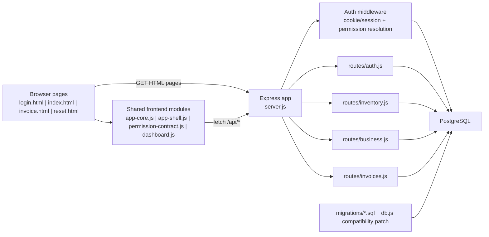
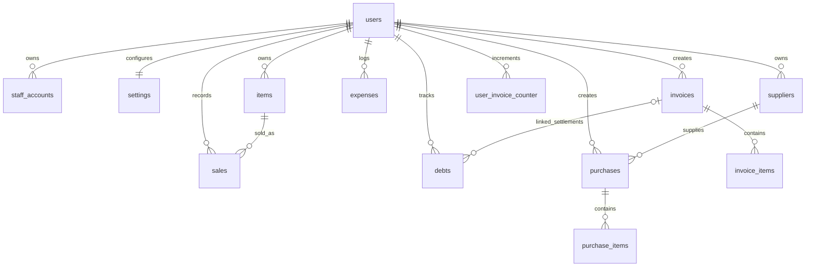
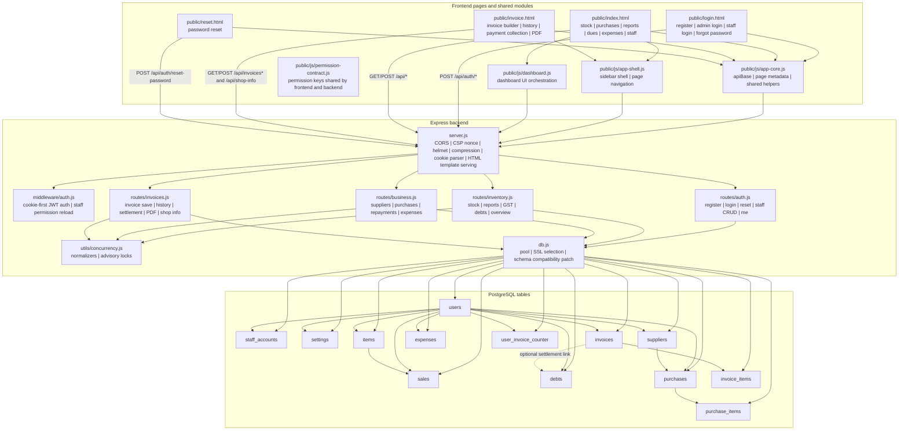

# India Inventory Management Documentation

Last verified against this repository: `2026-03-22`

This is the single merged documentation file for the project. It replaces the earlier split project doc and database schema doc.

## Table Of Contents

- [Purpose](#1-purpose)
- [Project Snapshot](#2-project-snapshot)
- [Technology Stack](#3-technology-stack)
- [Repository Map](#4-repository-map)
- [High-Level Architecture](#5-high-level-architecture)
- [Frontend Structure](#6-frontend-structure)
- [Backend Structure](#7-backend-structure)
- [Auth, Session, and Permission Model](#8-auth-session-and-permission-model)
- [Security and Runtime Guardrails](#9-security-and-runtime-guardrails)
- [Main Business Workflows](#10-main-business-workflows)
- [API Route Map](#11-api-route-map)
- [Database Schema](#12-database-schema)
- [Environment Variables](#13-environment-variables)
- [Maintenance Guide](#14-maintenance-guide)
- [Detailed Architecture Diagram](#15-detailed-architecture-diagram)
- [Final Summary](#16-final-summary)

## 1. Purpose

This document is meant to be the current source of truth for:

- what the project does
- how the frontend, backend, and database are organized
- which APIs exist
- which database tables exist and how they relate
- which files to edit for common future changes

Important current-state notes:

- Authentication is cookie-based. The frontend uses `credentials: "include"` and bootstraps sessions through `/api/auth/me`.
- `localStorage` is still used for UI state and invoice draft storage, but not as the primary auth token store.
- HTML pages are served through [`server.js`](../server.js), which injects a CSP nonce into inline scripts and styles.
- Database schema truth comes from the SQL files in [`migrations/`](../migrations) plus runtime compatibility patches in [`db.js`](../db.js).

## 2. Project Snapshot

This is a Node.js + Express + PostgreSQL business app for a shop owner.

Main business modules:

- admin registration and login
- staff login with page-level permissions
- stock entry and stock defaults
- purchase entry with supplier ledger and supplier repayment tracking
- sales invoice creation with PDF generation
- invoice history, due settlement, and payment collection
- customer due ledger
- sales, stock, and GST reports
- expense tracking and net profit visibility

The system is owner-centric:

- the `users` table stores the real business owner
- `staff_accounts` work under that owner
- almost all business data is stored against `user_id`
- staff actions operate inside the owner's data scope

## 3. Technology Stack

### Backend

- Node.js 18+
- Express
- PostgreSQL via `pg`
- JWT via `jsonwebtoken`
- `bcrypt` for password hashing
- `helmet`, `cors`, `cookie-parser`, `compression`, `express-rate-limit`
- `pdfkit` for PDF generation
- `exceljs` for Excel export

### Frontend

- static HTML pages in [`public/`](../public)
- vanilla JavaScript
- shared page configuration in [`public/js/app-core.js`](../public/js/app-core.js)
- shared sidebar shell in [`public/js/app-shell.js`](../public/js/app-shell.js)
- permission contract in [`public/js/permission-contract.js`](../public/js/permission-contract.js)
- charts via vendored [`public/js/chart.min.js`](../public/js/chart.min.js)

### Data and schema

- SQL schema snapshots in [`migrations/full_updated_schema.sql`](../migrations/full_updated_schema.sql)
- incremental migrations in [`migrations/20260321_business_workflow_finance.sql`](../migrations/20260321_business_workflow_finance.sql) and [`migrations/20260321_invoice_due_settlement.sql`](../migrations/20260321_invoice_due_settlement.sql)
- startup compatibility patching in [`db.js`](../db.js)

## 4. Repository Map

| Path                              | Purpose                                                                                    |
| --------------------------------- | ------------------------------------------------------------------------------------------ |
| [`../server.js`](../server.js)    | app bootstrap, middleware, CSP, route registration, HTML serving                           |
| [`../db.js`](../db.js)            | PostgreSQL pool setup and schema compatibility patches                                     |
| [`../middleware/`](../middleware) | auth and access control middleware                                                         |
| [`../routes/`](../routes)         | route files grouped by business domain                                                     |
| [`../public/`](../public)         | HTML pages, frontend JS, images                                                            |
| [`../utils/`](../utils)           | shared backend helpers like advisory locking                                               |
| [`../migrations/`](../migrations) | SQL schema and migration history                                                           |
| [`../docs/`](.)                   | project documentation, including this merged file and the manual functional test checklist |

### Key backend files

| File                                                 | Role                                                                                      |
| ---------------------------------------------------- | ----------------------------------------------------------------------------------------- |
| [`../server.js`](../server.js)                       | Express entrypoint, CSP nonce injection, CORS policy, health/debug routes, static serving |
| [`../db.js`](../db.js)                               | DB connection pool, SSL selection, startup schema patching                                |
| [`../middleware/auth.js`](../middleware/auth.js)     | JWT verification, role resolution, permission checks                                      |
| [`../routes/auth.js`](../routes/auth.js)             | register/login/logout, forgot/reset password, staff management, `/me`                     |
| [`../routes/inventory.js`](../routes/inventory.js)   | stock, stock reports, sales reports, GST reports, dashboard overview, customer dues       |
| [`../routes/business.js`](../routes/business.js)     | suppliers, purchases, purchase repayment, expenses                                        |
| [`../routes/invoices.js`](../routes/invoices.js)     | invoice numbering, invoice save, history, payment settlement, PDF, shop info              |
| [`../utils/concurrency.js`](../utils/concurrency.js) | normalization helpers and owner-scoped advisory locks                                     |

### Key frontend files

| File                                                                         | Role                                                                                 |
| ---------------------------------------------------------------------------- | ------------------------------------------------------------------------------------ |
| [`../public/login.html`](../public/login.html)                               | landing page, admin login/register, staff login, forgot password                     |
| [`../public/index.html`](../public/index.html)                               | main dashboard shell with stock, purchase, reports, due, expense, and staff sections |
| [`../public/invoice.html`](../public/invoice.html)                           | sale and invoice workspace, invoice history, PDF actions, shop profile               |
| [`../public/reset.html`](../public/reset.html)                               | reset password page                                                                  |
| [`../public/js/dashboard.js`](../public/js/dashboard.js)                     | main dashboard logic and report UI orchestration                                     |
| [`../public/js/app-core.js`](../public/js/app-core.js)                       | shared constants, permission descriptions, app bootstrap helpers                     |
| [`../public/js/app-shell.js`](../public/js/app-shell.js)                     | reusable sidebar shell and page navigation                                           |
| [`../public/js/permission-contract.js`](../public/js/permission-contract.js) | single permission vocabulary shared by backend and frontend                          |

## 5. High-Level Architecture



### Request flow in practice

1. Browser requests `login.html`, `index.html`, `invoice.html`, or `reset.html`.
2. [`server.js`](../server.js) serves those pages through `sendHtmlTemplate(...)`, replacing `__CSP_NONCE__` placeholders.
3. Frontend scripts call `/api/...` endpoints with `credentials: "include"`.
4. [`middleware/auth.js`](../middleware/auth.js) resolves the current session and staff permissions.
5. The matching route file runs business logic and queries PostgreSQL.
6. PDF and Excel exports are generated directly inside route handlers.

## 6. Frontend Structure

### Page responsibilities

| Page                                               | What it does                                                                           |
| -------------------------------------------------- | -------------------------------------------------------------------------------------- |
| [`../public/login.html`](../public/login.html)     | auth entrypoint for admin and staff, forgot password entry, existing-session redirect  |
| [`../public/index.html`](../public/index.html)     | multi-section dashboard for stock, purchases, reports, dues, expenses, and staff admin |
| [`../public/invoice.html`](../public/invoice.html) | invoice builder, draft restore, payment summary, invoice lookup, invoice PDF actions   |
| [`../public/reset.html`](../public/reset.html)     | password reset submission using email + token from URL hash                            |

### Shared frontend module roles

- [`../public/js/app-core.js`](../public/js/app-core.js)
  - defines the page permission descriptions and sidebar item metadata
  - resolves `apiBase`
  - exposes shared app-level helpers

- [`../public/js/app-shell.js`](../public/js/app-shell.js)
  - renders the sidebar
  - applies page-aware navigation
  - injects shell styles in a CSP-compatible way

- [`../public/js/permission-contract.js`](../public/js/permission-contract.js)
  - defines the canonical permission keys:
    - `add_stock`
    - `purchase_entry`
    - `sale_invoice`
    - `stock_report`
    - `sales_report`
    - `gst_report`
    - `customer_due`
    - `expense_tracking`

- [`../public/js/dashboard.js`](../public/js/dashboard.js)
  - drives most dashboard features
  - loads and submits stock, purchase, report, due, expense, and staff data
  - handles popups, section switching, and report export actions

### Frontend storage usage

Current frontend storage behavior:

- auth/session:
  - primary auth is cookie-based
  - the app checks `/api/auth/me` instead of relying on a persisted browser token
- `localStorage`:
  - `activeSection` for dashboard section persistence
  - `defaultProfitPercent` cache
  - invoice draft storage on `invoice.html`
  - cleanup of old `token`/`user` keys during logout or invalid session handling

## 7. Backend Structure

### `server.js`

[`server.js`](../server.js) is responsible for:

- creating the Express app
- enabling `trust proxy`
- building the CORS allowlist from `CORS_ALLOWED_ORIGINS` or `BASE_URL`
- generating a per-request CSP nonce
- applying `helmet`, compression, cookie parsing, JSON parsing, and rate limiting
- registering route files
- serving HTML pages through nonce-aware template injection
- exposing `/health`
- exposing debug routes only when:
  - `NODE_ENV !== "production"`
  - `ENABLE_DEBUG_ROUTES === "true"`

### `db.js`

[`db.js`](../db.js) is responsible for:

- validating `DATABASE_URL`
- choosing SSL automatically unless overridden by `DB_SSL`
- creating the shared PostgreSQL pool
- applying schema compatibility patches at startup

Compatibility patching currently ensures:

- `settings.default_profit_percent`
- `sales.cost_price`
- invoice payment columns on `invoices`
- `debts.invoice_id`
- creation of `suppliers`, `purchases`, `purchase_items`, `expenses`
- supporting indexes for those newer tables

### `middleware/auth.js`

[`middleware/auth.js`](../middleware/auth.js) does the following:

- reads the session token from the `token` cookie
- supports `Authorization: Bearer ...` as a fallback
- verifies the JWT using `JWT_SECRET`
- reloads active staff permissions from the database on each authenticated request
- exposes helpers:
  - `authMiddleware`
  - `getUserId(req)`
  - `getActorId(req)`
  - `requireAdmin`
  - `requirePermission(...)`
  - `allowRoles(...)`

### `utils/concurrency.js`

[`../utils/concurrency.js`](../utils/concurrency.js) provides:

- text normalization helpers for consistent lookup keys
- owner-scoped advisory locks via `pg_advisory_xact_lock`

Those locks are used to reduce race conditions for:

- supplier lookup/create flows
- invoice numbering and settlement-adjacent resource updates
- customer due operations

## 8. Auth, Session, and Permission Model

### Session model

- Admin login happens through `POST /api/auth/login`.
- Staff login happens through `POST /api/auth/staff/login`.
- On success, [`routes/auth.js`](../routes/auth.js) signs a JWT and stores it in an `httpOnly` cookie named `token`.
- Cookie settings:
  - `httpOnly: true`
  - `sameSite: "lax"`
  - `secure: true` only in production
  - max age: 1 day

### Client bootstrap

- `login.html` checks `/api/auth/me` to detect an active session.
- `index.html` and `invoice.html` use cookie-based requests with `credentials: "include"`.
- Frontend code no longer depends on a token response body to stay logged in.

### Staff permission model

Staff access is page-scoped and shared between backend and frontend through [`../public/js/permission-contract.js`](../public/js/permission-contract.js).

Important rules:

- staff accounts belong to an owner account
- max 2 staff accounts per owner is enforced in application logic
- admins always have all permissions
- staff page permissions are reloaded from `staff_accounts.page_permissions`
- frontend uses the same permission contract to hide or show sections
- backend uses `requirePermission(...)` to enforce actual access control

## 9. Security and Runtime Guardrails

Current hardening that is visible in the codebase:

- CSP with per-request nonce in [`../server.js`](../server.js)
- `script-src-attr 'none'` and `style-src-attr 'none'`
- `x-powered-by` disabled
- `helmet.frameguard`, `helmet.noSniff`, and `helmet.referrerPolicy`
- CORS allowlist instead of open production fallback
- global rate limit of `500` requests per `15` minutes
- login limiter in [`../routes/auth.js`](../routes/auth.js):
  - `10` attempts per `15` minutes
  - skips successful requests
- password reset limiter:
  - `5` attempts per `15` minutes
- password reset tokens are hashed before being stored in `users.reset_token`
- reset links place the token in the URL hash, so the token is not sent back to the server as a query parameter during initial page load
- auth-sensitive responses mark `Cache-Control: no-store`
- Excel export sanitizes formula-like cell values in [`../routes/inventory.js`](../routes/inventory.js)

One legacy compatibility detail still exists:

- [`../routes/invoices.js`](../routes/invoices.js) still accepts `?token=` for the invoice PDF route and turns it into an authorization header before `authMiddleware`.
- Current first-party frontend uses cookies, so this query-token path should be treated as backward compatibility only.

## 10. Main Business Workflows

### Admin registration

```text
login.html
  -> POST /api/auth/register
  -> users row created
  -> user returns to login
```

### Admin login

```text
login.html
  -> POST /api/auth/login
  -> token cookie set
  -> GET /api/auth/me succeeds
  -> redirect to index.html
```

### Staff login

```text
login.html
  -> POST /api/auth/staff/login
  -> token cookie set
  -> GET /api/auth/me returns staff session + permissions
  -> dashboard/invoice UI hides unauthorized sections
```

### Stock add or update

```text
index.html add stock section
  -> POST /api/items
  -> if item exists, quantity and rates can be updated
  -> if item does not exist, a new items row is inserted
```

### Purchase entry

```text
index.html purchase section
  -> POST /api/purchases
  -> supplier record is found or created
  -> purchases header is saved
  -> purchase_items rows are saved
  -> items stock quantity and rates are updated
  -> supplier due remains tracked through purchase payment fields
```

### Invoice creation

```text
invoice.html
  -> GET /api/invoices/new
  -> user adds customer info and item rows
  -> POST /api/invoices
  -> invoice_no generated
  -> invoices row inserted
  -> invoice_items rows inserted
  -> sales rows inserted
  -> items quantity reduced, or increased for return lines
  -> optional PDF download action
```

### Invoice due settlement

```text
invoice history / detail view
  -> POST /api/invoices/:invoiceNo/payment
  -> invoices.amount_paid / amount_due updated
  -> debts row inserted as settlement ledger entry
```

### Customer due management

```text
dashboard due section
  -> POST /api/debts for new ledger entries
  -> GET /api/debts/customers for search
  -> GET /api/debts/:number for one customer ledger
  -> GET /api/debts for all due summary
```

### Supplier repayment

```text
dashboard purchase section
  -> POST /api/purchases/:purchaseId/repayment
  -> purchase amount_paid / amount_due updated
  -> payment mode may become mixed
  -> purchase note gets repayment stamp context
```

### Reports and exports

```text
dashboard report sections
  -> stock report PDF
  -> sales report PDF + Excel
  -> GST report PDF + Excel
  -> sales trend charts
  -> purchase and expense reports in dashboard UI
```

## 11. API Route Map

All endpoints below are mounted under either `/api/auth` or `/api`.

### 11.1 Auth routes from `routes/auth.js`

| Method   | Path                                   | Purpose                                  |
| -------- | -------------------------------------- | ---------------------------------------- |
| `POST`   | `/api/auth/register`                   | create owner account                     |
| `POST`   | `/api/auth/login`                      | admin login by email or mobile           |
| `POST`   | `/api/auth/staff/login`                | staff login by username                  |
| `POST`   | `/api/auth/logout`                     | clear session cookie                     |
| `POST`   | `/api/auth/forgot-password`            | create reset token and send reset email  |
| `POST`   | `/api/auth/reset-password`             | validate reset token and update password |
| `GET`    | `/api/auth/staff`                      | list staff accounts for current owner    |
| `POST`   | `/api/auth/staff`                      | create a staff account                   |
| `PATCH`  | `/api/auth/staff/:staffId/permissions` | update page permissions                  |
| `DELETE` | `/api/auth/staff/:staffId`             | deactivate/remove a staff account        |
| `GET`    | `/api/auth/me`                         | return normalized current session        |

### 11.2 Inventory routes from `routes/inventory.js`

| Method | Path                             | Purpose                           |
| ------ | -------------------------------- | --------------------------------- |
| `GET`  | `/api/stock-defaults`            | load default profit percent       |
| `PUT`  | `/api/stock-defaults`            | save default profit percent       |
| `POST` | `/api/items`                     | add or update stock               |
| `GET`  | `/api/items/names`               | item name autocomplete            |
| `GET`  | `/api/items/info`                | item detail lookup by name        |
| `GET`  | `/api/items/report`              | stock report rows                 |
| `GET`  | `/api/items/low-stock`           | low stock list                    |
| `GET`  | `/api/items/reorder-suggestions` | reorder planner                   |
| `GET`  | `/api/items/report/pdf`          | stock report PDF                  |
| `GET`  | `/api/sales/report`              | sales report rows                 |
| `GET`  | `/api/sales/report/pdf`          | sales report PDF                  |
| `GET`  | `/api/sales/report/excel`        | sales report Excel                |
| `GET`  | `/api/gst/report`                | GST report rows                   |
| `GET`  | `/api/gst/report/pdf`            | GST report PDF                    |
| `GET`  | `/api/gst/report/excel`          | GST report Excel                  |
| `POST` | `/api/debts`                     | add customer due ledger entry     |
| `GET`  | `/api/debts/customers`           | search customers with dues        |
| `GET`  | `/api/debts/:number`             | load one customer ledger          |
| `GET`  | `/api/debts`                     | summary of all dues               |
| `GET`  | `/api/dashboard/overview`        | admin dashboard summary cards     |
| `GET`  | `/api/sales/monthly-trend`       | monthly sales chart data          |
| `GET`  | `/api/sales/last-13-months`      | rolling 13-month sales chart data |

### 11.3 Business routes from `routes/business.js`

| Method | Path                                   | Purpose                             |
| ------ | -------------------------------------- | ----------------------------------- |
| `GET`  | `/api/suppliers`                       | supplier search and quick lookup    |
| `POST` | `/api/purchases`                       | save purchase and restock inventory |
| `GET`  | `/api/purchases/report`                | purchase report list                |
| `GET`  | `/api/purchases/:purchaseId`           | purchase detail with line items     |
| `POST` | `/api/purchases/:purchaseId/repayment` | record supplier repayment           |
| `GET`  | `/api/suppliers/summary`               | supplier balance summary            |
| `GET`  | `/api/suppliers/:supplierId/ledger`    | supplier ledger / purchase history  |
| `POST` | `/api/expenses`                        | save expense entry                  |
| `GET`  | `/api/expenses/report`                 | expense report and summary          |

### 11.4 Invoice routes from `routes/invoices.js`

| Method | Path                               | Purpose                               |
| ------ | ---------------------------------- | ------------------------------------- |
| `GET`  | `/api/invoices/new`                | preview next invoice number           |
| `POST` | `/api/invoices`                    | create invoice and update stock/sales |
| `GET`  | `/api/invoices/suggestions`        | invoice search dropdown suggestions   |
| `GET`  | `/api/invoices/numbers`            | invoice number list                   |
| `GET`  | `/api/invoices`                    | invoice history list                  |
| `GET`  | `/api/invoices/:invoiceNo`         | full invoice detail                   |
| `POST` | `/api/invoices/:invoiceNo/payment` | receive invoice due payment           |
| `GET`  | `/api/invoices/:invoiceNo/pdf`     | invoice PDF download                  |
| `POST` | `/api/shop-info`                   | save owner shop profile               |
| `GET`  | `/api/shop-info`                   | load shop profile for invoice page    |

## 12. Database Schema

### 12.1 Schema source of truth

Primary schema references:

- [`../migrations/full_updated_schema.sql`](../migrations/full_updated_schema.sql)
- [`../migrations/20260321_business_workflow_finance.sql`](../migrations/20260321_business_workflow_finance.sql)
- [`../migrations/20260321_invoice_due_settlement.sql`](../migrations/20260321_invoice_due_settlement.sql)
- runtime compatibility patching in [`../db.js`](../db.js)

### 12.2 Ownership model

This app uses an owner-scoped model:

- `users` is the root business owner table
- `staff_accounts.owner_user_id` points back to the owner
- almost every business record stores `user_id`
- backend code uses `getUserId(req)` so staff always operate in owner scope

That means:

- one owner account controls one business data space
- staff do not get separate stock, invoice, or report databases
- deleting the owner cascades through most business tables

### 12.3 ER diagram



### 12.4 Table summary

| Table                  | Purpose                                        | Main feature area      |
| ---------------------- | ---------------------------------------------- | ---------------------- |
| `users`                | owner/admin accounts                           | auth                   |
| `staff_accounts`       | staff credentials and page permissions         | auth/staff             |
| `settings`             | shop profile, GST defaults, profit defaults    | invoice/settings/stock |
| `items`                | current stock master                           | inventory              |
| `sales`                | item-level sales movement history              | sales/reporting        |
| `debts`                | customer due ledger and invoice settlement log | dues                   |
| `suppliers`            | supplier master data                           | purchases              |
| `purchases`            | purchase header records                        | purchases              |
| `purchase_items`       | purchase line items                            | purchases              |
| `expenses`             | expense ledger                                 | finance                |
| `invoices`             | invoice header records                         | billing                |
| `invoice_items`        | invoice line items                             | billing                |
| `user_invoice_counter` | per-user daily invoice serial counter          | billing                |

### 12.5 Detailed table guide

#### `users`

Purpose:

- stores admin/owner accounts
- supports registration, login, and password reset
- owns all business data

Key columns:

- `id`
- `name`
- `email`
- `mobile_number`
- `password_hash`
- `reset_token`
- `reset_token_expires`
- `created_at`
- `updated_at`

Notes:

- `is_verified` and `verify_token` exist in schema, but current core flows are centered on login/reset rather than a full email-verification workflow

#### `staff_accounts`

Purpose:

- stores sub-users under one owner account
- keeps page-level access rules

Key columns:

- `id`
- `owner_user_id`
- `name`
- `username`
- `password_hash`
- `page_permissions`
- `is_active`
- `created_at`
- `updated_at`

Notes:

- max 2 staff accounts per owner is enforced in app logic, not with a DB constraint

#### `settings`

Purpose:

- one settings row per owner
- shared business defaults and invoice header details

Key columns:

- `user_id`
- `shop_name`
- `shop_address`
- `gst_no`
- `gst_rate`
- `default_profit_percent`

Notes:

- used by invoice shop profile
- used by stock and purchase flows for default profit calculations

#### `items`

Purpose:

- current live stock master table

Key columns:

- `user_id`
- `name`
- `quantity`
- `buying_rate`
- `selling_rate`
- `created_at`
- `updated_at`

Notes:

- purchase flow increases quantity
- invoice flow reduces quantity
- return-style negative invoice quantity can increase quantity back

#### `sales`

Purpose:

- stores item-wise sales movement
- acts as historical transaction data for reports

Key columns:

- `user_id`
- `item_id`
- `quantity`
- `cost_price`
- `selling_price`
- `total_price`
- `created_at`

Notes:

- `cost_price` was added in the finance migration and backfilled from `items.buying_rate` where possible
- there is no direct `invoice_id` foreign key here; invoice linkage is indirect through the invoice creation flow

#### `debts`

Purpose:

- customer due ledger
- used both for manual due entries and invoice-linked collections

Key columns:

- `user_id`
- `customer_name`
- `customer_number`
- `total`
- `credit`
- generated column `balance`
- `remark`
- `invoice_id`
- `created_at`
- `updated_at`

Notes:

- `invoice_id` is nullable
- settlement rows can reference an invoice
- manual due entries can exist without invoice linkage

#### `suppliers`

Purpose:

- supplier master records for purchase workflow

Key columns:

- `user_id`
- `name`
- `mobile_number`
- `address`
- `created_at`
- `updated_at`

Notes:

- supplier lookup uses normalized name/mobile matching
- supplier creation/update is protected with advisory locks

#### `purchases`

Purpose:

- purchase header or bill records

Key columns:

- `user_id`
- `supplier_id`
- `bill_no`
- `purchase_date`
- `subtotal`
- `amount_paid`
- `amount_due`
- `payment_mode`
- `payment_status`
- `note`
- `created_at`
- `updated_at`

Notes:

- repayment updates are written back into this row
- payment mode can become `mixed`

#### `purchase_items`

Purpose:

- line items for one purchase

Key columns:

- `purchase_id`
- `item_name`
- `quantity`
- `buying_rate`
- `selling_rate`
- `line_total`

Notes:

- this stores a snapshot of purchase data
- there is no direct foreign key to `items`

#### `expenses`

Purpose:

- tracks business expenses for net profit visibility

Key columns:

- `user_id`
- `title`
- `category`
- `amount`
- `payment_mode`
- `expense_date`
- `note`
- `created_at`
- `updated_at`

#### `invoices`

Purpose:

- invoice header records

Key columns:

- `user_id`
- `invoice_no`
- `gst_no`
- `customer_name`
- `contact`
- `address`
- `date`
- `subtotal`
- `gst_amount`
- `total_amount`
- `payment_mode`
- `payment_status`
- `amount_paid`
- `amount_due`
- `created_at`
- `updated_at`

Notes:

- invoice numbers follow the pattern `INV-YYYYMMDD-userId-####`
- payment state is stored directly on the invoice

#### `invoice_items`

Purpose:

- line items for a saved invoice

Key columns:

- `invoice_id`
- `description`
- `quantity`
- `rate`
- `amount`

#### `user_invoice_counter`

Purpose:

- keeps the next per-user daily invoice serial number

Key columns:

- `user_id`
- `date_key`
- `next_no`
- `created_at`

Notes:

- primary key is `(user_id, date_key)`
- this is the core table behind invoice number generation

### 12.6 Relationship notes and data flow

#### Direct foreign keys

- `staff_accounts.owner_user_id -> users.id`
- `items.user_id -> users.id`
- `sales.user_id -> users.id`
- `sales.item_id -> items.id`
- `debts.user_id -> users.id`
- `debts.invoice_id -> invoices.id`
- `suppliers.user_id -> users.id`
- `purchases.user_id -> users.id`
- `purchases.supplier_id -> suppliers.id`
- `purchase_items.purchase_id -> purchases.id`
- `expenses.user_id -> users.id`
- `settings.user_id -> users.id`
- `invoices.user_id -> users.id`
- `invoice_items.invoice_id -> invoices.id`
- `user_invoice_counter.user_id -> users.id`

#### Important indirect relationships

- `sales` rows are created during invoice save, but the schema does not store `invoice_id` inside `sales`
- `purchase_items` affect `items`, but the schema does not store `item_id` inside `purchase_items`
- invoice collections are recorded through `debts` rows with `invoice_id`

#### Main business data flows

Invoice save:

1. next invoice number is generated through `user_invoice_counter`
2. `invoices` header row is inserted
3. `invoice_items` rows are inserted
4. `items.quantity` is adjusted
5. `sales` rows are inserted
6. if the invoice is partial or due, due-related tracking continues through invoice payment fields and settlement rows

Purchase save:

1. supplier is found or created in `suppliers`
2. `purchases` header is inserted
3. `purchase_items` rows are inserted
4. `items` stock and rate snapshot are updated

Invoice collection:

1. invoice row is locked and updated
2. payment totals are recalculated
3. a `debts` row is inserted as a collection ledger line

### 12.7 Indexes, triggers, and compatibility behavior

Important index coverage includes:

- item lookup by normalized name
- supplier lookup by normalized name and mobile
- purchase report by `user_id, purchase_date`
- expense report by `user_id, expense_date`
- invoice history by `user_id, date`
- invoice items by `invoice_id`
- debt settlement lookup by `invoice_id`
- staff lookup by normalized username

Timestamp trigger coverage from [`../migrations/full_updated_schema.sql`](../migrations/full_updated_schema.sql):

- `users`
- `staff_accounts`
- `items`
- `debts`
- `suppliers`
- `purchases`
- `expenses`
- `invoices`

Runtime compatibility patching in [`../db.js`](../db.js) exists so older databases can be brought closer to current expectations even before a full migration pass is run.

## 13. Environment Variables

| Variable               | Required                                        | Purpose                                                          |
| ---------------------- | ----------------------------------------------- | ---------------------------------------------------------------- |
| `DATABASE_URL`         | yes                                             | PostgreSQL connection string                                     |
| `DB_SSL`               | optional                                        | force SSL on or off; otherwise auto-detected from `DATABASE_URL` |
| `JWT_SECRET`           | yes                                             | signing key for session JWTs                                     |
| `PORT`                 | optional                                        | HTTP port; defaults to `8080`                                    |
| `NODE_ENV`             | optional                                        | production/development behavior                                  |
| `CORS_ALLOWED_ORIGINS` | recommended                                     | comma-separated allowlist for cross-origin requests              |
| `BASE_URL`             | recommended, effectively required in production | public app base URL, also used in reset links                    |
| `MAIL_RELAY_URL`       | optional                                        | outbound mail relay endpoint                                     |
| `MAIL_RELAY_KEY`       | optional                                        | credential for mail relay                                        |
| `ENABLE_DEBUG_ROUTES`  | optional                                        | enable `/debug-env` and `/debug-db` in non-production            |

## 14. Maintenance Guide

### If you want to change login, reset password, or session behavior

Edit:

- [`../routes/auth.js`](../routes/auth.js)
- [`../middleware/auth.js`](../middleware/auth.js)
- [`../public/login.html`](../public/login.html)
- [`../public/reset.html`](../public/reset.html)

### If you want to change shared navigation or permission names

Edit:

- [`../public/js/permission-contract.js`](../public/js/permission-contract.js)
- [`../public/js/app-core.js`](../public/js/app-core.js)
- [`../public/js/app-shell.js`](../public/js/app-shell.js)
- backend guards in [`../middleware/auth.js`](../middleware/auth.js)

### If you want to change dashboard stock, purchase, report, due, or expense features

Edit:

- [`../public/index.html`](../public/index.html)
- [`../public/js/dashboard.js`](../public/js/dashboard.js)
- [`../routes/inventory.js`](../routes/inventory.js)
- [`../routes/business.js`](../routes/business.js)

### If you want to change invoice flow or PDF output

Edit:

- [`../public/invoice.html`](../public/invoice.html)
- [`../routes/invoices.js`](../routes/invoices.js)
- [`../middleware/auth.js`](../middleware/auth.js) if auth behavior also changes

### If you want to change database schema

Edit:

- [`../migrations/full_updated_schema.sql`](../migrations/full_updated_schema.sql) for the latest full snapshot
- add a new incremental SQL file in [`../migrations/`](../migrations)
- update compatibility logic in [`../db.js`](../db.js) if old databases also need startup patching
- update this document after the schema change

## 15. Detailed Architecture Diagram



## 16. Final Summary

This codebase is organized around a single owner-scoped business workspace:

- frontend pages are static HTML with shared vanilla JS modules
- Express route files are grouped by business domain
- PostgreSQL stores all operational data for stock, invoices, purchases, dues, expenses, and staff control
- authentication is cookie-based, with staff permissions enforced on both frontend and backend
- this document is now the single merged reference for both application structure and database schema
