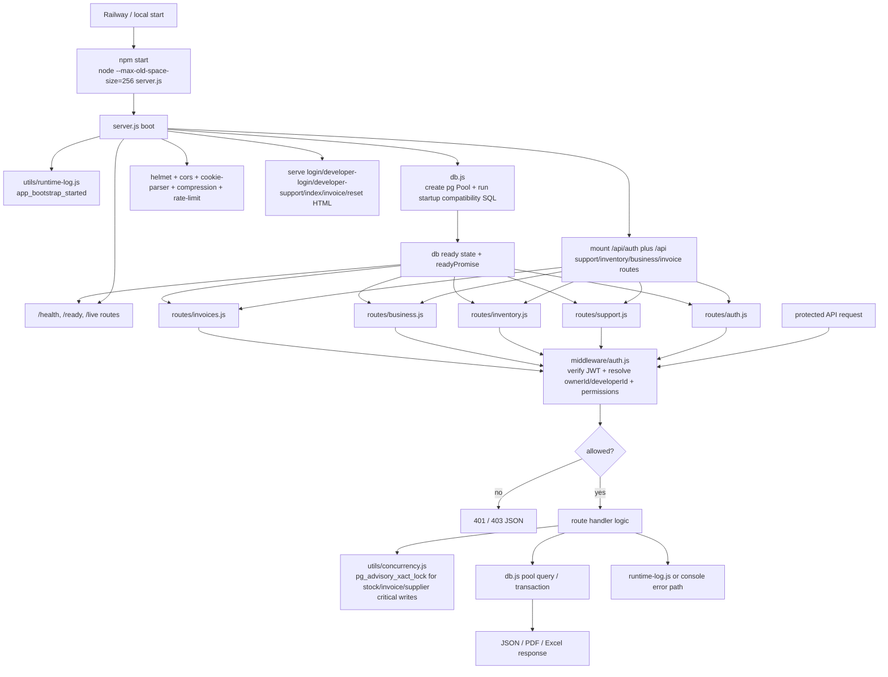
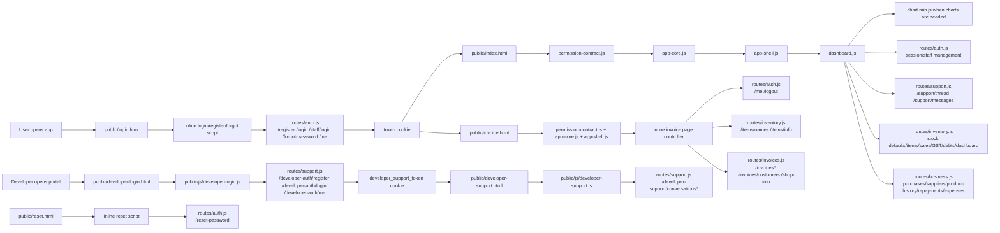

# Detailed File Flow Chart

Last verified against this repository: `2026-05-07`

This document maps the runtime-relevant app files in the repository and shows how they connect in practice.

## 1. Repository-Wide File Dependency Chart

```mermaid
flowchart TD
  subgraph Infra["Runtime and deployment"]
    PackageJson["package.json<br/>Node runtime + dependencies"]
    PackageLock["package-lock.json<br/>locked dependency tree"]
    Railway["railway.json<br/>Railway start/health/restart policy"]
  end

  subgraph Entry["Server entry layer"]
    Server["server.js<br/>Express bootstrap + CSP + static pages + route mount"]
    DB["db.js<br/>PostgreSQL pool + startup compatibility patches"]
    AuthMW["middleware/auth.js<br/>owner/staff/developer JWT auth + guards"]
    RuntimeLog["utils/runtime-log.js<br/>structured lifecycle/request logging + redaction"]
    Concurrency["utils/concurrency.js<br/>advisory locks + shared text normalization"]
  end

  subgraph Routes["API route files"]
    AuthRoute["routes/auth.js<br/>owner register/login/staff/session/reset"]
    SupportRoute["routes/support.js<br/>developer auth + support chat + inbox"]
    InventoryRoute["routes/inventory.js<br/>stock/sales/reports/debts/dashboard"]
    BusinessRoute["routes/business.js<br/>purchases/suppliers/product history/repayments/expenses"]
    InvoiceRoute["routes/invoices.js<br/>invoice create/customer lookup/list/pdf/payment/shop info"]
  end

  subgraph SharedFront["Shared frontend JS"]
    PermContract["public/js/permission-contract.js<br/>shared permission contract"]
    AppCore["public/js/app-core.js<br/>frontend app config + access helpers"]
    AppShell["public/js/app-shell.js<br/>sidebar shell + mobile navigation"]
    DashboardJS["public/js/dashboard.js<br/>dashboard page controller + stock/purchase autocomplete"]
    DevLoginJS["public/js/developer-login.js<br/>developer auth page controller"]
    DevSupportJS["public/js/developer-support.js<br/>developer inbox controller"]
    ChartLib["public/js/chart.min.js<br/>chart library"]
  end

  subgraph Pages["HTML entry pages"]
    LoginPage["public/login.html<br/>public auth UI + inline auth script"]
    DevLoginPage["public/developer-login.html<br/>developer login/register UI"]
    DevSupportPage["public/developer-support.html<br/>developer support queue UI"]
    ResetPage["public/reset.html<br/>reset password UI + inline reset script"]
    IndexPage["public/index.html<br/>dashboard shell HTML + purchase/product history cards"]
    InvoicePage["public/invoice.html<br/>invoice studio HTML + billing customer autocomplete"]
    Logo["public/images/app_logo.png<br/>brand asset"]
  end

  subgraph DataModel["Database schema reference"]
    Schema["migrations/full_updated_schema.sql<br/>schema snapshot"]
  end

  PackageLock --> PackageJson
  PackageJson --> Server
  PackageJson --> DB
  PackageJson --> AuthRoute
  PackageJson --> SupportRoute
  PackageJson --> InventoryRoute
  PackageJson --> BusinessRoute
  PackageJson --> InvoiceRoute
  Railway --> Server

  Server --> RuntimeLog
  Server --> DB
  Server --> AuthRoute
  Server --> SupportRoute
  Server --> InventoryRoute
  Server --> BusinessRoute
  Server --> InvoiceRoute
  Server --> LoginPage
  Server --> DevLoginPage
  Server --> DevSupportPage
  Server --> ResetPage
  Server --> IndexPage
  Server --> InvoicePage

  DB --> RuntimeLog
  Schema -. informs schema expectations .-> DB

  PermContract --> AppCore
  PermContract --> AuthMW
  PermContract --> AuthRoute

  AuthMW --> AuthRoute
  AuthMW --> SupportRoute
  AuthMW --> InventoryRoute
  AuthMW --> BusinessRoute
  AuthMW --> InvoiceRoute

  Concurrency --> InventoryRoute
  Concurrency --> BusinessRoute
  Concurrency --> InvoiceRoute

  AppCore --> AppShell
  AppCore --> DashboardJS
  AppCore --> InvoicePage

  AppShell --> IndexPage
  AppShell --> InvoicePage

  ChartLib --> DashboardJS
  DashboardJS --> IndexPage
  DevLoginJS --> DevLoginPage
  DevSupportJS --> DevSupportPage

  LoginPage --> AuthRoute
  DevLoginPage --> SupportRoute
  DevSupportPage --> SupportRoute
  ResetPage --> AuthRoute
  IndexPage --> PermContract
  IndexPage --> AppCore
  IndexPage --> AppShell
  IndexPage --> DashboardJS
  IndexPage --> Logo
  InvoicePage --> PermContract
  InvoicePage --> AppCore
  InvoicePage --> AppShell
  InvoicePage --> AuthRoute
  InvoicePage --> InventoryRoute
  InvoicePage --> InvoiceRoute
```

## 2. Backend Runtime Flow

## 3. Frontend Page Flow

## 4. File Role Catalog

| Path                                 | Main role                                                                                                                           | Primary connections                                                            |
| ------------------------------------ | ----------------------------------------------------------------------------------------------------------------------------------- | ------------------------------------------------------------------------------ |
| `package.json`                       | Declares Node runtime, start script, and app dependencies                                                                           | Drives `server.js`, route files, `db.js`, PDF/Excel/auth libs                  |
| `package-lock.json`                  | Pins exact dependency versions                                                                                                      | Supports deterministic install from `package.json`                             |
| `railway.json`                       | Railway deployment instructions                                                                                                     | Starts `server.js`, checks `/health`, restarts on failure                      |
| `server.js`                          | Main app bootstrap                                                                                                                  | Uses `db.js`, `runtime-log.js`, mounts all route files, serves HTML pages      |
| `db.js`                              | Global PostgreSQL pool and readiness state                                                                                          | Queried by all route files, logged by `runtime-log.js`, informed by schema SQL |
| `middleware/auth.js`                 | JWT/session verification and permission guard for owner, staff, and developer routes                                                | Used by all protected route files, imports shared permission contract          |
| `utils/runtime-log.js`               | Structured JSON logging with sensitive-field redaction                                                                              | Used by `server.js` and `db.js` for startup/request/error/shutdown logs        |
| `utils/concurrency.js`               | Advisory lock helper and shared text normalization                                                                                  | Used by write-heavy route files to avoid duplicate concurrent writes           |
| `routes/auth.js`                     | Owner registration, login, staff login, session, logout, password reset, staff management                                           | Uses `db.js`, `middleware/auth.js`, shared permission contract                 |
| `routes/support.js`                  | Developer auth, owner/staff support thread, developer inbox, replies, status updates                                                | Uses `db.js`, `middleware/auth.js`                                             |
| `routes/inventory.js`                | Stock entry, stock defaults, sales reports, GST compare/export, debts, dashboard, trends                                            | Uses `db.js`, `middleware/auth.js`, `utils/concurrency.js`                     |
| `routes/business.js`                 | Supplier search, purchase save, product purchase history, supplier ledger, repayments, expenses                                     | Uses `db.js`, `middleware/auth.js`, `utils/concurrency.js`                     |
| `routes/invoices.js`                 | Invoice number preview, invoice save, customer suggestions, invoice PDF, invoice lookup, payments, shop info                        | Uses `db.js`, `middleware/auth.js`, `utils/concurrency.js`                     |
| `public/login.html`                  | Public entry page for owner login, staff login, registration, forgot password                                                       | Inline JS calls `routes/auth.js` endpoints                                     |
| `public/developer-login.html`        | Developer account login/register page                                                                                               | Loads `public/js/developer-login.js`, calls `routes/support.js` auth endpoints |
| `public/developer-support.html`      | Developer inbox UI                                                                                                                  | Loads `public/js/developer-support.js`, calls `routes/support.js` inbox APIs   |
| `public/reset.html`                  | Password reset page                                                                                                                 | Inline JS posts to `routes/auth.js` reset endpoint                             |
| `public/index.html`                  | Dashboard HTML layout including support chat, purchase supplier autocomplete, and Product Purchase History                          | Loads `permission-contract.js`, `app-core.js`, `app-shell.js`, `dashboard.js`  |
| `public/invoice.html`                | Invoice workspace HTML with Billing details customer autocomplete                                                                   | Loads shared JS files and contains its own inline invoice controller           |
| `public/js/permission-contract.js`   | Shared owner/staff permission map                                                                                                   | Loaded by frontend and imported by backend Node files                          |
| `public/js/app-core.js`              | Frontend app-wide config and access helper registry                                                                                 | Builds `window.InventoryApp` from permission contract                          |
| `public/js/app-shell.js`             | Shared sidebar shell and mobile navigation behavior                                                                                 | Renders sidebar for dashboard and invoice pages                                |
| `public/js/dashboard.js`             | Dashboard controller for stock reset/save, supplier autocomplete, product purchase history, dues, expenses, staff, reports, support | Uses `window.InventoryApp`, `window.InventoryAppShell`, and backend APIs       |
| `public/js/developer-login.js`       | Developer login/register controller                                                                                                 | Calls `/api/developer-auth/*` with cookie-based auth                           |
| `public/js/developer-support.js`     | Developer inbox page controller                                                                                                     | Calls `/api/developer-support/*` with cookie-based auth                        |
| `public/js/chart.min.js`             | Chart rendering library                                                                                                             | Lazily loaded by `dashboard.js` when sales charts are needed                   |
| `public/images/app_logo.png`         | Brand/logo asset                                                                                                                    | Used by the public and developer-facing HTML pages                             |
| `migrations/full_updated_schema.sql` | Full schema snapshot                                                                                                                | Reference source for DB structure alongside runtime patching in `db.js`        |

## 5. Highest-Value Cross-File Relationships

1. `server.js -> routes/* -> db.js`
   This is the main backend execution chain. Every API request eventually reaches the shared PostgreSQL pool.

2. `public/js/permission-contract.js -> app-core.js -> app-shell.js/dashboard.js`
   This is the main dashboard frontend chain. Permission metadata is defined once, then reused for access checks and sidebar rendering.

3. `public/js/permission-contract.js -> middleware/auth.js` and `routes/auth.js`
   This is the main shared frontend/backend contract. Staff page permissions are normalized the same way on both sides.

4. `public/index.html -> dashboard.js -> routes/support.js`
   The owner/staff dashboard now includes support-thread reads and writes in addition to stock, purchase, and report traffic.

5. `public/developer-login.html -> public/js/developer-login.js -> routes/support.js`
   The dedicated developer portal is its own auth surface and now relies on cookie-based developer sessions.

6. `public/developer-support.html -> public/js/developer-support.js -> routes/support.js`
   The developer inbox is a separate page that loads queue summaries, thread messages, reply actions, and status changes.

7. `utils/concurrency.js -> inventory.js/business.js/invoices.js`
   This helper protects critical write paths like stock updates, supplier creation, and invoice writes from duplicate concurrent mutations.

8. `public/index.html -> clearAddStockBtn -> dashboard.js/resetAddStockForm`
   The Add Stock card's Clear button uses the same reset helper that runs after a successful stock save, clearing item, quantity, buying rate, selling rate, dropdown state, and previous-rate preview while keeping the saved `Profit %` default untouched.

9. `public/index.html -> dashboard.js -> routes/business.js`
   Purchase Entry uses `/api/suppliers` for supplier autocomplete and autofill. The Product Purchase History card uses `/api/purchases/product-history` to join purchase item rows back to purchase bills and suppliers.

10. `public/invoice.html -> inline invoice controller -> routes/invoices.js`
    Billing details customer autocomplete uses `/api/invoices/customers` to read prior invoice customer name, contact, and address values, then fills the invoice form without changing the invoice save/PDF flow.

## 6. Practical Reading Order

If someone new joins the project, the fastest file-reading order is:

1. `package.json`
2. `server.js`
3. `db.js`
4. `middleware/auth.js`
5. `routes/auth.js`
6. `routes/support.js`
7. `routes/inventory.js`
8. `routes/business.js`
9. `routes/invoices.js`
10. `public/js/permission-contract.js`
11. `public/js/app-core.js`
12. `public/js/app-shell.js`
13. `public/js/dashboard.js`
14. `public/js/developer-login.js`
15. `public/js/developer-support.js`
16. `public/index.html`
17. `public/invoice.html`
18. `public/login.html`
19. `public/developer-login.html`
20. `public/developer-support.html`
21. `public/reset.html`

That order follows the actual runtime flow from bootstrapping, to access control, to backend features, to the owner/staff frontend, and finally to the developer support portal.
