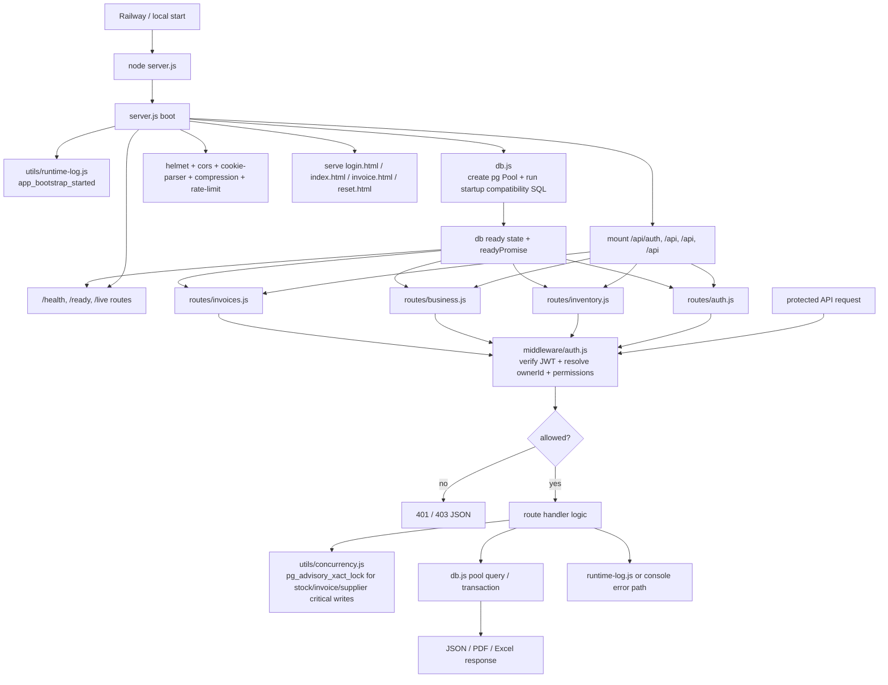
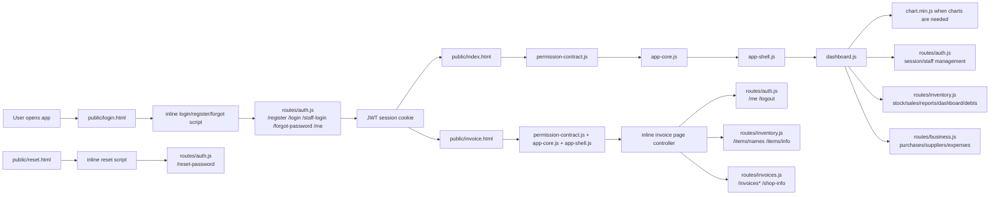

# Detailed File Flow Chart

Last verified against this repository: `2026-04-12`

This document maps every tracked source file in the repository and shows how the files connect at runtime.

## 1. Repository-Wide File Dependency Chart

```mermaid
flowchart TD
  subgraph Infra["Runtime and deployment"]
    PackageJson["package.json<br/>Node runtime + dependencies"]
    PackageLock["package-lock.json<br/>locked dependency tree"]
    Railway["railway.json<br/>Railway start/health/restart policy"]
  end

  subgraph Entry["Server entry layer"]
    Server["server.js<br/>Express bootstrap + CSP + static pages + route mount"]
    DB["db.js<br/>PostgreSQL pool + startup compatibility patches"]
    AuthMW["middleware/auth.js<br/>JWT auth + owner/staff permission guards"]
    RuntimeLog["utils/runtime-log.js<br/>structured lifecycle/request logging"]
    Concurrency["utils/concurrency.js<br/>advisory locks + shared text normalization"]
  end

  subgraph Routes["API route files"]
    AuthRoute["routes/auth.js<br/>register/login/staff/session/reset"]
    InventoryRoute["routes/inventory.js<br/>stock/sales/reports/debts/dashboard"]
    BusinessRoute["routes/business.js<br/>purchases/suppliers/repayments/expenses"]
    InvoiceRoute["routes/invoices.js<br/>invoice create/list/pdf/payment/shop info"]
  end

  subgraph SharedFront["Shared frontend JS"]
    PermContract["public/js/permission-contract.js<br/>shared permission contract"]
    AppCore["public/js/app-core.js<br/>frontend app config + access helpers"]
    AppShell["public/js/app-shell.js<br/>sidebar shell + mobile navigation"]
    DashboardJS["public/js/dashboard.js<br/>dashboard page controller"]
    ChartLib["public/js/chart.min.js<br/>chart library"]
  end

  subgraph Pages["HTML entry pages"]
    LoginPage["public/login.html<br/>public auth UI + inline auth script"]
    ResetPage["public/reset.html<br/>reset password UI + inline reset script"]
    IndexPage["public/index.html<br/>dashboard shell HTML"]
    InvoicePage["public/invoice.html<br/>invoice studio HTML + inline invoice script"]
    Logo["public/images/app_logo.png<br/>brand asset"]
  end

  subgraph SchemaDocs["Schema and support docs"]
    Schema["migrations/full_updated_schema.sql<br/>schema snapshot"]
    FullDoc["docs/COMPLETE_PROJECT_DOCUMENTATION.md<br/>full architecture reference"]
    TestDoc["docs/MANUAL FUNCTIONAL TEST LIST.md<br/>manual regression checklist"]
  end

  PackageLock --> PackageJson
  PackageJson --> Server
  PackageJson --> DB
  PackageJson --> AuthRoute
  PackageJson --> InventoryRoute
  PackageJson --> BusinessRoute
  PackageJson --> InvoiceRoute
  Railway --> Server

  Server --> RuntimeLog
  Server --> DB
  Server --> AuthRoute
  Server --> InventoryRoute
  Server --> BusinessRoute
  Server --> InvoiceRoute
  Server --> LoginPage
  Server --> ResetPage
  Server --> IndexPage
  Server --> InvoicePage

  DB --> RuntimeLog
  Schema -. informs schema expectations .-> DB

  PermContract --> AppCore
  PermContract --> AuthMW
  PermContract --> AuthRoute

  AuthMW --> AuthRoute
  AuthMW --> InventoryRoute
  AuthMW --> BusinessRoute
  AuthMW --> InvoiceRoute

  Concurrency --> InventoryRoute
  Concurrency --> BusinessRoute
  Concurrency --> InvoiceRoute

  AppCore --> AppShell
  AppCore --> DashboardJS
  AppCore --> InvoicePage

  AppShell --> IndexPage
  AppShell --> InvoicePage

  ChartLib --> DashboardJS
  DashboardJS --> IndexPage

  LoginPage --> AuthRoute
  ResetPage --> AuthRoute
  IndexPage --> PermContract
  IndexPage --> AppCore
  IndexPage --> AppShell
  IndexPage --> DashboardJS
  IndexPage --> Logo

  InvoicePage --> PermContract
  InvoicePage --> AppCore
  InvoicePage --> AppShell
  InvoicePage --> AuthRoute
  InvoicePage --> InventoryRoute
  InvoicePage --> InvoiceRoute

  FullDoc -. documents .-> Server
  FullDoc -. documents .-> DB
  FullDoc -. documents .-> InventoryRoute
  FullDoc -. documents .-> BusinessRoute
  FullDoc -. documents .-> InvoiceRoute
  TestDoc -. validates .-> LoginPage
  TestDoc -. validates .-> ResetPage
  TestDoc -. validates .-> IndexPage
  TestDoc -. validates .-> InvoicePage
```

## 2. Backend Runtime Flow

## 3. Frontend Page Flow

## 4. File Role Catalog

| Path | Main role | Primary connections |
| --- | --- | --- |
| `package.json` | Declares Node runtime, start script, and app dependencies | Drives `server.js`, route files, `db.js`, PDF/Excel/auth libs |
| `package-lock.json` | Pins exact dependency versions | Supports deterministic install from `package.json` |
| `railway.json` | Railway deployment instructions | Starts `server.js`, checks `/health`, restarts on failure |
| `server.js` | Main app bootstrap | Uses `db.js`, `runtime-log.js`, mounts all route files, serves HTML pages |
| `db.js` | Global PostgreSQL pool and readiness state | Queried by all route files, logged by `runtime-log.js`, informed by schema SQL |
| `middleware/auth.js` | JWT/session verification and permission guard | Used by all protected route files, imports shared permission contract |
| `utils/runtime-log.js` | Structured JSON logging | Used by `server.js` and `db.js` for startup/request/error/shutdown logs |
| `utils/concurrency.js` | Advisory lock helper and shared text normalization | Used by write-heavy route files to avoid duplicate concurrent writes |
| `routes/auth.js` | Owner registration, login, staff login, session, logout, password reset, staff management | Uses `db.js`, `middleware/auth.js`, shared permission contract |
| `routes/inventory.js` | Stock entry, stock defaults, sales reports, GST, debts, dashboard, trends | Uses `db.js`, `middleware/auth.js`, `utils/concurrency.js` |
| `routes/business.js` | Supplier search, purchase save, purchase report, supplier ledger, repayments, expenses | Uses `db.js`, `middleware/auth.js`, `utils/concurrency.js` |
| `routes/invoices.js` | Invoice number preview, invoice save, invoice PDF, invoice lookup, payments, shop info | Uses `db.js`, `middleware/auth.js`, `utils/concurrency.js` |
| `public/login.html` | Public entry page for owner login, staff login, registration, forgot password | Inline JS calls `routes/auth.js` endpoints |
| `public/reset.html` | Password reset page | Inline JS posts to `routes/auth.js` reset endpoint |
| `public/index.html` | Dashboard HTML layout | Loads `permission-contract.js`, `app-core.js`, `app-shell.js`, `dashboard.js` |
| `public/invoice.html` | Invoice workspace HTML | Loads shared JS files and contains its own inline invoice controller |
| `public/js/permission-contract.js` | Shared owner/staff permission map | Loaded by frontend and imported by backend Node files |
| `public/js/app-core.js` | Frontend app-wide config and access helper registry | Builds `window.InventoryApp` from permission contract |
| `public/js/app-shell.js` | Shared sidebar shell and mobile navigation behavior | Renders sidebar for dashboard and invoice pages |
| `public/js/dashboard.js` | Dashboard page controller for stock, purchases, dues, expenses, staff, reports | Uses `window.InventoryApp`, `window.InventoryAppShell`, and backend APIs |
| `public/js/chart.min.js` | Chart rendering library | Lazily loaded by `dashboard.js` when sales charts are needed |
| `public/images/app_logo.png` | Brand/logo asset | Used by `login.html` and available to other pages |
| `migrations/full_updated_schema.sql` | Full schema snapshot | Reference source for DB structure alongside runtime patching in `db.js` |
| `docs/COMPLETE_PROJECT_DOCUMENTATION.md` | Project-wide architecture and maintenance doc | Describes server, DB, routes, runtime behavior |
| `docs/MANUAL FUNCTIONAL TEST LIST.md` | Manual test checklist | Covers login, dashboard, invoice, health, and business flows |

## 5. Highest-Value Cross-File Relationships

1. `server.js -> routes/* -> db.js`
   This is the main backend execution chain. Every API request eventually reaches the shared PostgreSQL pool.

2. `public/js/permission-contract.js -> app-core.js -> app-shell.js/dashboard.js`
   This is the main dashboard frontend chain. Permission metadata is defined once, then reused for access checks and sidebar rendering.

3. `public/js/permission-contract.js -> middleware/auth.js` and `routes/auth.js`
   This is the most important shared frontend/backend contract in the repo. Staff page permissions are normalized the same way on both sides.

4. `public/index.html -> dashboard.js -> routes/inventory.js + routes/business.js + routes/auth.js`
   The dashboard page is a multi-domain frontend entry point and talks to several backend route files at once.

5. `public/invoice.html -> routes/invoices.js + routes/inventory.js + routes/auth.js`
   The invoice page is its own self-contained UI but still depends on the shared auth/session layer and inventory lookups.

6. `utils/concurrency.js -> inventory.js/business.js/invoices.js`
   This helper protects critical write paths like stock updates, supplier creation, and invoice writes from duplicate concurrent mutations.

## 6. Practical Reading Order

If someone new joins the project, the fastest file-reading order is:

1. `package.json`
2. `server.js`
3. `db.js`
4. `middleware/auth.js`
5. `routes/auth.js`
6. `routes/inventory.js`
7. `routes/business.js`
8. `routes/invoices.js`
9. `public/js/permission-contract.js`
10. `public/js/app-core.js`
11. `public/js/app-shell.js`
12. `public/js/dashboard.js`
13. `public/index.html`
14. `public/invoice.html`
15. `public/login.html`
16. `public/reset.html`

That order follows the actual runtime flow from bootstrapping, to access control, to backend features, to frontend entry points.
